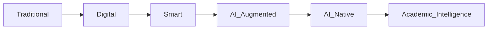
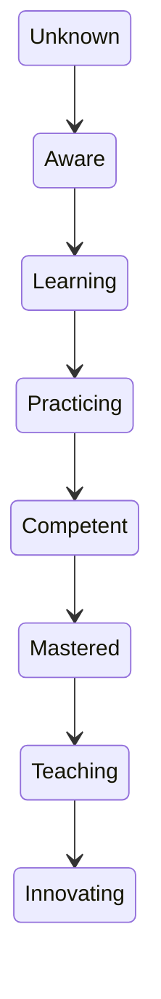
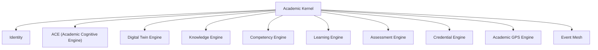
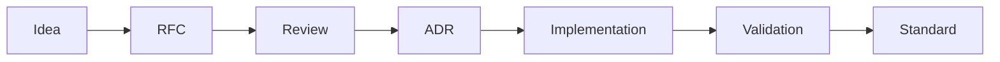

# BOOK-00 — Executive Vision & Manifesto
## DLU Architecture Standard (DAS)
### Version 2.0 — DRAFT for review

> Foundational white paper of the DLU AI-Native University and root document of the
> DLU Architecture Masterbook (BOOK-00 … BOOK-20).
>
> **Supersedes:** v1.0. Changes: normative language and conformance model; pedagogical
> grounding of the CAT model; new chapters on the Human Institution, Trust & Assessment
> Integrity, and Institutional Viability; expanded ADRs and standards alignment
> (1EdTech, EU AI Act); canonical terminology; success metrics; full 20-book plan;
> **Annex A — normative baseline mapping to the DLU Builder Turnkey implementation.**

---

## Document Status and Normative Language

This document is **normative** for all Books, ADRs, RFCs and implementations claiming
conformance to the DLU Architecture Standard.

The key words **MUST**, **MUST NOT**, **SHOULD**, **SHOULD NOT** and **MAY** are to be
interpreted as described in RFC 2119. Statements without these keywords are
informative.

**Conformance levels:**

| Level | Meaning |
|-------|---------|
| DAS-Core | Implements the Academic Kernel contracts (BOOK-03/04/05) and invariants of this book |
| DAS-Intelligent | DAS-Core + Digital Twin, ACE, GPS and AI Workforce (BOOK-06…14) |
| DAS-Certified | DAS-Intelligent + governance, integrity and compliance requirements (BOOK-15/16/19) audited |

The **first reference implementation** is DLU Builder Turnkey (`dlu_builder_tk`),
whose mapping to this standard is defined in BOOK-18. **Annex A** of this book
establishes the implementation baseline: which kernel engines already exist in
Turnkey, which are partial, and which are planned. This standard is deliberately
**descriptive of the running system where it exists and prescriptive only where it
does not** — it is a systematization of the current DLU AI-Native University, not a
parallel greenfield design (ADR-0008).

---

# Executive Summary

Higher education is entering a structural transformation driven by Artificial
Intelligence. Most universities are introducing AI as an additional capability layered
on top of existing LMS, SIS and administrative platforms. The result is faster
administration of an unchanged model.

DLU proposes a different approach. Rather than asking *"How can AI improve today's
university?"*, DLU asks:

> **"How should a university be designed if Artificial Intelligence had always been available?"**

The answer developed across this Masterbook is an **Academic Operating System (AOS)**:
a kernel of ten academic engines orchestrating knowledge, competencies, evidence,
human mentorship and AI agents around a continuously evolving **Student Digital Twin**.

Three commitments distinguish DLU from both traditional digitalization and naive
AI automation:

1. **Evidence over enthusiasm.** Every pedagogical claim in this standard is grounded
   in learning science, and every AI recommendation is explainable and auditable.
2. **The human institution is a feature, not a legacy.** Faculty mentorship, peer
   community and human accountability are architected, not eroded.
3. **Trust is the product.** In an AI-saturated world, the scarce asset of a
   university is credible evidence of human capability. Assessment integrity and
   verifiable credentials are therefore kernel concerns, not add-ons.

---

# Intended Audience

- Rectors, Presidents and Provosts
- Academic Boards and Quality Assurance bodies
- CIOs and Chief Digital Officers
- Enterprise, AI and Data Architects
- Product Managers and Software Engineers
- Researchers and Instructional Designers
- Accreditation and regulatory stakeholders

# How to Read this Masterbook

| Audience | Recommended focus |
|----------|-------------------|
| Executives | Executive Summary, Ch. 2–3, Ch. 13–14, Book plan |
| Academic leaders | Ch. 4–5, Ch. 11–12, BOOK-01/02 |
| Architects | Ch. 6–10, ADRs, BOOK-03…14 |
| Engineers | Ch. 6, glossary, BOOK-15…20 |
| QA / Compliance | Ch. 11–13, BOOK-19 |

---

# Chapter 1 — The Need for a New Academic Paradigm

Traditional universities are organised around courses, semesters, departments and
examinations. Digital platforms have improved administration but preserved the model.
The symptoms are structural, not incidental:

- **Completion and time-to-degree** stagnate while cost per credential rises
  (Baumol's cost disease applies fully to seat-time-based education).
- **The skills gap**: employers report that transcripts predict neither competence
  nor readiness; degrees compress years of heterogeneous evidence into a single
  ordinal grade.
- **One-speed pedagogy**: Bloom (1984) showed mastery learning with tutoring shifts
  achievement by ~2 sigma; industrial-era universities cannot afford one tutor per
  learner. AI changes that constraint for the first time.
- **Credential trust erosion**: generative AI makes uninvigilated artifacts
  (essays, take-home projects) unreliable as evidence, undermining the epistemic
  basis of grading itself.

DLU therefore shifts from **course-centric administration** to **learner
transformation**: learning becomes continuous, adaptive and evidence-based, and the
institution is re-architected around the question *"what can this person now do,
and how do we know?"*.

---

# Chapter 2 — Executive Vision

## Mission

Maximise the lifelong transformation of every learner through the orchestration of
knowledge, competencies, human mentorship and Artificial Intelligence.

## Vision

Every learner benefits from a continuously evolving **academic intelligence** capable
of answering, at any moment, the **Seven Canonical Questions**:

| # | Question | Answered by (kernel engine) |
|---|----------|------------------------------|
| 1 | Who is the learner? | Digital Twin (identity, behaviour) |
| 2 | What does the learner really know? | Competency + Assessment Engines (evidence) |
| 3 | Where does the learner want to go? | Digital Twin (career layer) |
| 4 | What is the optimal path? | Academic GPS Engine |
| 5 | What should the learner do next? | ACE + Recommendation capability |
| 6 | Why is this recommendation appropriate? | Explainability contract (ADR-0006) |
| 7 | How does it serve long-term goals? | GPS scenario alignment |

> The Seven Questions unify the five of the original Foundation document and the
> five of Manifesto v1.0, which had drifted apart. They are **canonical**: every
> Book MUST map its capabilities to at least one question, and no capability that
> serves none of them belongs in the kernel.



---

# Chapter 3 — AI-Native University Manifesto

Ten principles. Each is stated as a **preference under tension** — a manifesto that
denies its trade-offs is advertising.

1. **Transformation over transactions.** Universities transform people, not credits.
   *Tension:* credits remain the currency of mobility and accreditation; DLU keeps
   them as a projection of competency evidence, never as the primary object.
2. **Continuous learning over terminal degrees.** *Tension:* milestones still matter
   for motivation and signalling; the lifecycle keeps ritual moments (graduation)
   while the twin never closes.
3. **Competencies over attendance.** *Tension:* presence builds community; attendance
   is tracked as a community signal, never as a proxy for learning.
4. **Interconnected knowledge over siloed courses.** Knowledge is a graph; courses
   are curated paths through it, not containers that own it.
5. **AI amplification over AI replacement.** AI multiplies the reach of educators.
   *Tension:* efficiency pressure will push toward substitution; governance
   (Ch. 11) makes substitution of accountable human judgment a violation.
6. **A personal academic intelligence for every learner.** *Tension:* personalization
   vs. a shared canon and shared experience — DLU personalizes the *path*, not the
   *truth*; core curricula and cohort experiences are preserved deliberately.
7. **Explainable recommendations over black-box optimization.** If it cannot be
   explained to the learner, it MUST NOT be recommended to the learner.
8. **Human responsibility over automated authority.** Every high-impact decision has
   a named human owner (HITL). AI proposes; the institution decides.
9. **Ecosystems over walled gardens.** Standards-based interoperability (Ch. 10) is
   constitutive, not optional.
10. **Desirable difficulty over frictionless comfort.** Learning requires effortful
    retrieval, spacing and struggle (Bjork). An AI that removes all friction removes
    the learning. Optimization targets *transformation*, not *satisfaction* alone.

---

# Chapter 4 — Academic Philosophy

## 4.1 The Continuous Academic Transformation (CAT) model

```text
Unknown → Aware → Learning → Practicing → Competent → Mastered → Teaching → Innovating
```



CAT is deliberately grounded in established learning science rather than invented
ex novo:

| CAT stage span | Grounding |
|----------------|-----------|
| Unknown → Aware | Conscious-competence ladder; curiosity/goal activation (self-determination theory) |
| Learning → Practicing | Skill acquisition (Dreyfus & Dreyfus novice→proficient); deliberate practice (Ericsson); retrieval practice and spacing |
| Competent → Mastered | Mastery learning (Bloom); constructive alignment of outcomes-activities-assessment (Biggs); SOLO taxonomy for depth |
| Teaching → Innovating | Protégé effect / learning-by-teaching; legitimate peripheral participation (Lave & Wenger); creation as highest-order outcome (Bloom revised) |

Normative consequences:

- Progression between stages MUST be driven by **evidence**, never by time elapsed.
- The learner MUST be able to see and contest their own model (**open learner
  model**): visibility of the twin improves metacognition and trust.
- Assessment design MUST follow constructive alignment: outcome → activity →
  evidence, declared before content is authored.

## 4.2 Knowledge, competency, evidence — the epistemic triangle

- **Knowledge** answers *"What do I know?"* — represented as concepts in the
  Academic Knowledge Network (BOOK-13), with probabilistic mastery state.
- **Competency** answers *"What am I capable of accomplishing?"* — framework-aligned
  (EQF/ESCO/DigComp/SFIA), levelled, portable.
- **Evidence** answers *"Why should anyone believe it?"* — immutable, sourced,
  trust-weighted records linking artifacts to claims.

No claim without evidence; no evidence without provenance; no credential without
both. This triangle is the invariant beneath every engine.

---

# Chapter 5 — The Human Institution *(new in v2.0)*

An AI-native university is not a solitary learner with a chatbot. Decades of
retention research (Tinto) show social and academic integration drive persistence.
DLU therefore architects the human fabric explicitly:

## 5.1 Faculty transformation

The professor's time is reallocated, not eliminated:

| Industrial university | DLU AI-native university |
|-----------------------|--------------------------|
| Content delivery (lectures at scale) | Curation and validation of AI-authored content |
| Grading artifacts | Designing assessments; verifying high-stakes evidence; oral defenses |
| Office hours (scarce) | Mentorship, research supervision, Socratic seminars (abundant, because AI absorbs routine tutoring) |
| Administrative reporting | Reviewing AI proposals in HITL queues; academic judgment |

Faculty own **pedagogical authority**: agents operate within envelopes faculty
define (BOOK-07, Faculty Digital Twin, models workload, expertise and delegation
envelopes). Academic freedom applies to agent configuration: faculty MAY tune, and
MUST be able to inspect, any agent acting within their courses.

## 5.2 Community and belonging

Cohorts, study groups, peer review, teaching-as-learning (CAT stages 7–8) are
first-class kernel objects, not forum plugins. The Student Success capability
optimizes for **belonging signals**, not only engagement metrics.

## 5.3 Human accountability map

Every kernel decision type has a named accountable human role (registrar, program
director, instructor, advisor). BOOK-19 defines the full RACI; the invariant here:
**no AI output enters a student's official record without a human in the
accountability chain.**

---

# Chapter 6 — Academic Operating System

DLU is designed as an **Academic Operating System (AOS)**, not an LMS. The metaphor
is carried through precisely, because it dictates architecture:

| OS concept | AOS equivalent |
|-----------|----------------|
| Kernel | Academic Kernel: ten engines with stable contracts |
| System calls | Kernel APIs — the only way experiences mutate academic state |
| Processes | Learning missions / agent missions, schedulable and observable |
| Scheduler | Academic GPS + ACE orchestration (what runs next for this learner) |
| Memory | Twin layers + Memory Architecture (BOOK-12) |
| Drivers | Integrations: SIS/ERP, LMS delivery, identity, payment (BOOK-18) |
| User space | Experiences (WS00–WS08 student; faculty and institution workspaces) |
| Interrupts | Event Mesh — everything reacts to events, nothing polls |

```text
Applications → Experiences → Academic Domains → Academic Services → Academic Kernel
```

## 6.1 The Academic Kernel — ten engines



| Engine | Responsibility (one line) | Specified in |
|--------|---------------------------|--------------|
| Identity Engine | Who is acting; roles, consent, privacy boundaries | BOOK-04/19 |
| Academic Cognitive Engine (ACE) | Reasoning, agent orchestration, recommendation, explanation | BOOK-09/11 |
| Digital Twin Engine | Layered state of student, faculty, institution twins | BOOK-06/07/08 |
| Knowledge Engine | Concept graph, prerequisites, mastery state | BOOK-13 |
| Competency Engine | Framework-aligned competency state + confidence | BOOK-04/05 |
| Learning Engine | Content, missions, delivery, pacing | BOOK-17 |
| Assessment Engine | Evidence pipeline: activity → assessment → evidence | BOOK-15 |
| Credential Engine | Criteria, issuance, verification, revocation (VC/Open Badges) | BOOK-16 |
| Academic GPS Engine | Deterministic path optimization and scenario planning | BOOK-14 |
| Event Mesh | Closed event taxonomy, at-least-once delivery, outbox | BOOK-03 |

## 6.2 Kernel invariants

1. Experiences MUST NOT own academic state; they read via kernel APIs and mutate via
   kernel services/events.
2. The Event Mesh taxonomy is **closed**: new event types require an RFC.
3. Evidence records are **append-only**.
4. GPS paths are computed **deterministically**; LLMs narrate, they never rank or plan.
5. Every LLM invocation flows through the governed gateway with tenant-scoped keys
   and pre-call quota enforcement.
6. All AI outputs shown to learners are traceable to inputs (explanation trace,
   model, request id).

## 6.3 Non-goals

The AOS is NOT: a replacement for official student records systems (it mirrors them),
an identity provider, a general-purpose agent platform, a proctoring product, or an
attempt to automate academic governance.

---

# Chapter 7 — Design Principles

- Student-centric · Competency-centric · Evidence-based
- AI-native · Human-in-the-loop · Explainable AI
- Event-driven · Graph-centric information · Continuous optimisation
- Lifelong learning
- **Desirable difficulty** (v2.0): optimize for durable learning, not minimal effort
- **Open learner model** (v2.0): the learner sees, and can contest, their own twin
- **Privacy & consent by design** (v2.0): personalization is a consented service,
  degradable to a non-personalized but fully functional experience

---

# Chapter 8 — DLU Architecture Standard (DAS)

Every architectural decision follows the cascade — technology never defines pedagogy:

```text
Academic Philosophy → Pedagogical Model → Business Architecture
→ Reference Architecture → Information Architecture → AI Architecture
→ Technical Architecture → Technology Selection
```

The standard itself is versioned (semver). Books carry independent versions but MUST
declare the DAS version they conform to. Breaking changes to kernel contracts require
a major DAS version and a migration Book appendix.

---

# Chapter 9 — Architecture Decision Records

ADRs follow the template in `templates/ADR-template.md` (context, decision,
alternatives considered, consequences). Registry:

| ADR | Decision | Status |
|-----|----------|--------|
| ADR-0001 | DLU is an Academic Operating System, not an LMS | Accepted |
| ADR-0002 | Competencies are first-class entities, framework-aligned | Accepted |
| ADR-0003 | Knowledge is represented as semantic graphs (property graph + SKOS alignment) | Accepted |
| ADR-0004 | Every learner evolves through a layered Digital Twin (composite read model, not a mega-entity) | Accepted |
| ADR-0005 | AI augments, never replaces, academic governance (HITL tiers) | Accepted |
| ADR-0006 | Recommendations must be explainable — explanation trace is schema-enforced | Accepted |
| ADR-0007 | Capabilities are exposed as services with stable kernel contracts | Accepted |
| ADR-0008 *(new)* | Brownfield-first: the standard is implemented by extending DLU Builder Turnkey, not greenfield | Proposed |
| ADR-0009 *(new)* | Official records remain in the institutional ERP (ERPNext in the reference implementation); the kernel mirrors read-only | Proposed |
| ADR-0010 *(new)* | Event backbone: closed taxonomy on streams with outbox pattern; broker is swappable | Proposed |
| ADR-0011 *(new)* | Credentials: W3C VC + Open Badges 3.0 / CLR 2.0 as the portable format | Proposed |
| ADR-0012 *(new)* | Evidence is append-only and trust-weighted; `verified` status requires a human | Proposed |
| ADR-0013 *(new)* | All model access via a governed LLM gateway (multi-provider, per-tenant keys, quotas) | Proposed |

## Open RFCs

- Academic Operating System vs Academic Intelligence Platform (naming/positioning)
- Unified Academic Intelligence Graph (single graph vs federated graphs)
- Academic Twin persistence model (event-sourced vs read-model composite)
- Verifiable Credentials issuer/DID strategy per institution
- AI Agent interoperability (MCP as the inter-agent contract surface)
- Assessment integrity architecture (authentic assessment vs proctoring mix)

---

# Chapter 10 — Alignment with International Frameworks

DLU aligns with and extends:

| Framework / Standard | Purpose in DLU |
|----------------------|----------------|
| EQF | Qualification level alignment |
| ESCO | Skills and occupations grounding (career layer, GPS) |
| DigComp | Digital competency framework |
| SFIA | Professional capability framework |
| CEFR | Language competency (where applicable) |
| **1EdTech xAPI / Caliper** | Learning activity evidence streams |
| **1EdTech Open Badges 3.0 / CLR 2.0** | Portable, verifiable achievement records |
| **1EdTech LTI 1.3 / OneRoster** | Tool and roster interoperability |
| **1EdTech CASE** | Machine-readable competency framework exchange |
| W3C Verifiable Credentials / DID | Credential trust fabric |
| **Europass / ELM** | EU learning model & diploma portability |
| RDF, OWL, SKOS | Ontology and semantic alignment (BOOK-05) |
| ISO/IEC 42001, ISO/IEC 27001 | AI management & information security |
| **EU AI Act** | Education is an Annex III high-risk domain — see Ch. 12 |
| GDPR / FERPA | Learner data protection, dual-region posture |
| TOGAF / ArchiMate / ISO 42010 | Enterprise architecture description |

> v1.0 omitted the 1EdTech family entirely — for an interoperable credential and
> evidence strategy this was the most serious gap in the chapter. It is now
> normative: evidence ingestion MUST speak xAPI; credential export MUST support
> Open Badges 3.0; competency frameworks SHOULD be importable via CASE.

---

# Chapter 11 — Governance

Four complementary layers, each with a named body and decision rights (full RACI in
BOOK-19):

| Layer | Body | Owns |
|-------|------|------|
| Academic Governance | Academic Senate / Program Boards | Curriculum, outcomes, assessment policy, CAT stage criteria |
| AI Governance | AI Review Board (faculty + students + ethics + engineering) | Agent autonomy tiers, model changes affecting pedagogy, red-teaming, incident response |
| Data Governance | Data Protection Office | Consent taxonomy, retention, twin erasure, cross-border transfer |
| Architecture Governance | Architecture Board | DAS conformance, ADR/RFC lifecycle, kernel contract changes |



**HITL autonomy tiers (normative):**

| Tier | Example | Policy |
|------|---------|--------|
| Act | formative quiz generation, study nudges | Execute with audit record |
| Propose | credit recognition, interventions, summative feedback | Human confirms |
| Reserved | credential issuance (beyond auto-badges), enrollment changes, anything touching official records or money | Human decides; AI only prepares |

**Model change control:** any change of model, prompt template or retrieval corpus
that affects learner-facing behaviour is a governed release (versioned, evaluated
against a regression suite of pedagogical scenarios, rollback-able).

---

# Chapter 12 — Trust, Risk & Assessment Integrity *(new in v2.0)*

## 12.1 Regulatory posture

Under the **EU AI Act**, AI systems used for education and vocational training —
admission, evaluation, proctoring, and steering of learning — fall in **Annex III
(high-risk)**. DLU therefore treats the following as compliance requirements, not
aspirations: risk management system, data governance, technical documentation,
record-keeping (logs), transparency to users, human oversight, accuracy/robustness
monitoring. BOOK-19 maps each obligation to kernel mechanisms.

## 12.2 Assessment integrity — the existential question

If generative AI can produce any artifact, artifacts alone are dead as evidence.
DLU's integrity strategy is layered:

1. **Authentic assessment first**: projects with process evidence (versioned work
   history, in-context checkpoints), not single terminal artifacts.
2. **Dialogic verification**: AI-assisted oral defense / Socratic vivas for
   high-stakes claims (the Assessment Agent prepares; a human examines).
3. **Trust-weighted evidence**: every evidence record carries source trust; an
   unproctored artifact can raise confidence but never alone reach `verified`.
4. **Triangulation**: competency status requires converging evidence types.
5. **Proportionality**: surveillance-heavy proctoring is a last resort, never the
   default (privacy principle).

## 12.3 Risk register (top-level; living register in BOOK-19)

| Risk | Vector | Primary mitigation |
|------|--------|--------------------|
| Hallucinated tutoring content | LLM generation | Retrieval grounding mandatory; no ungrounded generation to learners |
| Bias in recommendations/assessment | Training data, proxies | Explanation traces, disparate-impact monitoring, AI Review Board audits |
| Epistemic filter bubbles | Over-personalization | Personalize path not canon; curriculum core; serendipity quota in recommendations |
| De-skilling via frictionless AI | Product pressure | Desirable-difficulty principle enforced in Learning Engine defaults |
| Credential fraud | Fake/outsourced evidence | Ch. 12.2 strategy; VC revocation lists |
| Model vendor lock-in / cost shock | Single provider | Gateway abstraction, multi-provider routing, local model fallback |
| Privacy breach of twin data | Rich centralized profile | Layered consent, minimization (aggregates not raw streams), regional isolation |
| Automation creep past HITL | Operational pressure | Autonomy tiers are schema-enforced, audited, and board-reviewed |

---

# Chapter 13 — Institutional Viability *(new in v2.0)*

A university that cannot be accredited, funded and staffed is a demo. BOOK-02
develops the full institutional theory; the commitments at manifesto level:

1. **Accreditation strategy is dual-track**: (a) map competency evidence back to
   credit-hour and ECTS projections so existing accreditors can evaluate programs;
   (b) engage quality agencies (ENQA/EQAR space in the EU, regional accreditors in
   the US) on evidence-based models. DLU MUST always be able to emit a traditional
   transcript as a *view* over the evidence graph.
2. **Adoption archetypes**: greenfield AI-native institution; transformation of an
   existing university (brownfield — the reference implementation path); corporate
   academy; reseller/consortium. The kernel is identical; experiences and governance
   profiles differ.
3. **Unit economics**: AI tutoring shifts cost from marginal human hours to
   inference and orchestration. Cost per learner MUST be observable per engine
   (gateway usage accounting) so pricing and sustainability are managed on data.
4. **Faculty economics**: reallocated faculty time (Ch. 5.1) is budgeted and
   recognized in workload models — otherwise the transformation fails socially
   before it fails technically.

---

# Chapter 14 — Success Metrics

A manifesto without falsifiable criteria is marketing. Platform-level KPIs
(targets set per institution in BOOK-02):

| Domain | Metric |
|--------|--------|
| Access | Enrollment conversion; credit recognition rate & turnaround |
| Learning | Competency growth rate; mastery durability (spaced re-assessment); completion rate |
| Guidance | Recommendation acceptance & downstream efficacy; GPS re-plan stability |
| Trust | % AI outputs with complete explanation trace (target 100%); evidence verification SLA; credential verification uptime |
| Human fabric | Mentorship hours per learner (should **rise**); belonging/community index; faculty satisfaction |
| Outcomes | Time-to-goal; employability signal vs. target occupations; alumni lifelong re-engagement |
| Wellbeing & equity | Disparate-impact deltas across cohorts on all of the above |

**Metrics discipline:** engagement alone is never a north star (Principle 10); every
optimization loop declares its target metric and its guardrail metrics.

---

# Chapter 15 — Research Agenda

- Academic Intelligence & open learner modeling
- Digital Twins for education (fidelity vs privacy trade-offs)
- Knowledge graphs & neuro-symbolic curriculum reasoning
- Competency intelligence (confidence calibration, decay models)
- Multi-agent pedagogy (tutor/coach/assessor orchestration effects)
- AI-assisted assessment & integrity (dialogic verification at scale)
- Lifelong learning economics and credential ecosystems

---

# Chapter 16 — The Masterbook Plan (BOOK-01 … BOOK-20)

Complete, normative enumeration (v1.0 left Books 15–20 undefined and gave
Assessment, Credentials and Governance no dedicated Books):

| Book | Title | Scope | Primary audience | Depends on |
|------|-------|-------|------------------|-----------|
| 01 | Academic Philosophy & Pedagogical Model | CAT in depth, learning science foundations, constructive alignment, open learner model | Academic leaders | 00 |
| 02 | AI-Native University Theory | Organizational model, human institution, faculty transformation, economics, accreditation | Executives, provosts | 00, 01 |
| 03 | Academic Operating System | AOS reference architecture, kernel contracts, event mesh, non-functionals | Architects | 00 |
| 04 | Academic Domain Model | Entities, aggregates, lifecycle states, identity & consent model | Architects, engineers | 03 |
| 05 | Academic Ontology & Semantic Model | RDF/OWL/SKOS alignment, framework imports (CASE/ESCO), naming | Ontologists | 04 |
| 06 | Student Digital Twin | Layered twin spec, context assembly, versioning, erasure | Architects, engineers | 04, 05 |
| 07 | Faculty Digital Twin | Expertise, workload, delegation envelopes, pedagogical authority | Architects | 06 |
| 08 | Institution Digital Twin | Institutional state, program health, capacity, compliance posture | Architects | 06 |
| 09 | Academic Cognitive Engine (ACE) | Orchestration, routing, context budgets, memory writes, explanation | AI architects | 06, 11 |
| 10 | AI Workforce | Agent catalog & contracts, autonomy tiers, HITL queues, MCP interop | AI architects | 09 |
| 11 | AI Cognitive Architecture | Reasoning patterns, RAG/GraphRAG, guardrails, evaluation harness | AI engineers | 09 |
| 12 | Memory Architecture | Episodic/semantic/procedural memory, salience, expiry, privacy | AI engineers | 06, 09 |
| 13 | Academic Knowledge Network | Knowledge graph schema, mastery overlay, sync, graph analytics | Graph engineers | 05 |
| 14 | Academic Intelligence Navigator (GPS) | Deterministic path optimization, scenarios, replanning, explanations | Architects | 13, 06 |
| 15 | Assessment & Evidence Architecture | Evidence pipeline, integrity strategy, trust weights, dialogic verification | Assessment leads | 04, 13 |
| 16 | Credential & Trust Architecture | VC/Open Badges/CLR, issuance policy, wallets, revocation, transcripts-as-views | Registrars, engineers | 15 |
| 17 | Experiences | Student WS00–WS08, faculty & institution workspaces as kernel views | Product, UX | 03…16 |
| 18 | Technical Architecture & Turnkey Integration | Mapping DAS → `dlu_builder_tk` (models, services, gateway, events), deployment | Engineers | all |
| 19 | Governance, Security & Compliance | RACI, AI Act mapping, GDPR/FERPA, risk register, audit, model change control | QA, compliance | 00, 03 |
| 20 | Implementation Blueprint | Roadmap, sprint decomposition (RooCode/Claude prompts), acceptance tests, KPIs instrumentation | Delivery teams | all |

**Repository mapping:** Books live in this repository; `docs/00-manifesto` …
`docs/08-research` provide the MkDocs navigation; `workspaces/WS00…WS08` hold
experience specifications (Book 17 views); `implementation/` holds Book 20 artifacts.

**Source-of-content rule:** Books MUST be written by systematizing the existing
Turnkey documentation and code (Annex A), never by re-inventing it. Where a Book
diverges from the running system, the divergence MUST be stated as an explicit gap
with a migration note — silent divergence between standard and implementation is a
conformance failure.

---

# Glossary (canonical terminology — normative)

| Term | Definition | Deprecated synonyms |
|------|------------|---------------------|
| Academic Operating System (AOS) | The layered architecture with the Academic Kernel at its core | "platform", "LMS" |
| Academic Kernel | The ten engines and their stable contracts | — |
| Academic Cognitive Engine (ACE) | Kernel engine for reasoning, orchestration and explanation | "Academic Brain" |
| Digital Twin | Layered, versioned state of a learner/faculty/institution | "Academic Twin", "profile" |
| Academic GPS | Deterministic path optimization engine | "Navigator" (the *agent* explaining GPS output keeps the name Academic Navigator) |
| Competency | Framework-aligned, levelled capability with confidence and evidence | "skill" (reserved for ESCO sub-competency) |
| Evidence Record | Immutable, trust-weighted link between an artifact and a claim | — |
| Learning Mission | Schedulable unit of learning activity (AOS "process") | — |
| Event Mesh | The closed, streamed event taxonomy | "event bus" |
| CAT | Continuous Academic Transformation model (8 stages) | — |

---

# Bibliography

**Learning sciences:** Bloom, *The 2 Sigma Problem* (1984); Biggs & Tang,
*Constructive Alignment*; SOLO Taxonomy; Dreyfus & Dreyfus, skill acquisition;
Ericsson, deliberate practice; Bjork, desirable difficulties; Roediger & Karpicke,
retrieval practice; Lave & Wenger, situated learning; Tinto, student departure;
Deci & Ryan, self-determination theory; Bull & Kay, open learner models; Corbett &
Anderson, Bayesian Knowledge Tracing.

**Frameworks:** EQF; ESCO; DigComp; SFIA; CEFR; 1EdTech (xAPI, Caliper, Open Badges
3.0, CLR 2.0, LTI 1.3, CASE, OneRoster); Europass/ELM.

**Architecture:** TOGAF; ArchiMate; ISO/IEC/IEEE 42010; ISO/IEC 42001; ISO/IEC 27001.

**Knowledge & AI:** W3C Verifiable Credentials & DID; RDF, OWL, SKOS; Neo4j Graph
Data Science; EU AI Act (Regulation (EU) 2024/1689).

---

# Annex A — Reference Implementation Baseline (DLU Builder Turnkey) *(normative)*

This annex anchors the standard to the running system. Status legend:
✅ implemented · 🟡 partial (exists, needs extension per this standard) · 🔵 designed
(specified in `dlu_builder_tk/docs/STUDENT_EXPERIENCE_ARCHITECTURE.md`, not yet built) ·
⚪ planned (no design yet — target of a future Book).

## A.1 Kernel engines → Turnkey assets

| Kernel engine | Existing Turnkey assets | Status | Gap to DAS |
|---------------|------------------------|--------|-----------|
| Identity Engine | Keycloak OIDC/SAML integration (`saml_service`, `oidc_service`, `auth_*`), `platform.users`, RBAC, multi-tenant isolation (PostgreSQL RLS + schema-per-tenant) | ✅ | Consent taxonomy centralization (Twin `consent_flags`, 🔵) |
| ACE | `agent_orchestrator_service`, AI Management v2.0 registry (`ai_agent_configs`, `ai_skill_registry`, `ai_mcp_servers`, `ai_model_presets`), `pedagogical_coach_service`, `learner_tutor_service` | 🟡 | Academic Brain routing/missions layer (🔵 STX-06); authoring-centric orchestration must generalize to learner-facing agents |
| Digital Twin Engine | `LearnerProfile`, `tutor_context_service`, learner routes (`/api/learners/*`) | 🟡 | Seven-layer twin + `TwinContextService` (🔵 STX-01/02); Faculty & Institution twins ⚪ (BOOK-07/08) |
| Knowledge Engine | Neo4j KG v1.0 (`kg_build/query/export`, GraphRAG, `curriculum_graph_service`, `prerequisite_service`), BKT mastery (`concept_mastery`, `mastery_tracking_service`) | ✅ | KG v1.2 competency + student overlay (🔵 STX-05) |
| Competency Engine | `Competency`, `CLOCompetency`, ILO/PLO/CLO/MLO models, `competency_library_service`, `competency_tagging_service` | 🟡 | Frameworks (EQF/ESCO/SFIA), `StudentCompetency` + confidence, `EvidenceRecord` (🔵 STX-04) |
| Learning Engine | Course Factory, 9-type media enrichment, SCORM export, Moodle Mode A/B, `StudentCoursePlayer`, pacing/cohorts, spaced repetition | ✅ | Learning-mission abstraction (BOOK-17) |
| Assessment Engine | Quiz/lab runtime, Bloom quiz service, grading, quiz feedback, xAPI (`xapi_service`) + Caliper (`caliper_emitter`) ingestion | 🟡 | Evidence pipeline assessment→CLO→competency (🔵 STX-08); integrity strategy (Ch. 12.2) ⚪ (BOOK-15) |
| Credential Engine | `credential_service` (course badges, VC JSON), `UserBadge`, badge routes | 🟡 | Open Badges 3.0/CLR, criteria templates, wallet, public verify (🔵 STX-13) |
| Academic GPS Engine | `eta_service`, `curriculum_graph_service`, `prerequisite_service`, ExternalCourse (credit recognition data) | 🔵 | Scenario optimizers + path-health (STX-07/12) |
| Event Mesh | `EventService`, `kg_event_bus`, Redis pub/sub, `EVENT_CATALOG.md`, xAPI/Caliper streams | 🟡 | Closed `student.*` taxonomy on Redis Streams + outbox (🔵 STX-03) |

## A.2 Cross-cutting concerns → Turnkey assets

| DAS concern | Turnkey asset | Status |
|-------------|--------------|--------|
| Governed LLM gateway (ADR-0013) | ACP Gateway — LiteLLM proxy, per-tenant virtual keys, synchronous quota enforcement, usage callback (`ACP_GATEWAY_ARCHITECTURE.md`) | ✅ |
| Official records boundary (ADR-0009) | ERPNext Education as source of truth; n8n event bridge; DLU read-only mirrors (`UNIVERSITY_PLATFORM_ARCHITECTURE.md` §5) | ✅ (architecture) |
| AI governance & audit | `ai_governance_service`, AI proposals/approval routes, generation audit tables | 🟡 |
| Multi-region compliance | `UNIVERSITY_PLATFORM_COMPLIANCE_MULTIREGION.md` (GDPR/FERPA, dual-region) | 🟡 — AI Act mapping ⚪ (BOOK-19) |
| Observability & zero trust | `UNIVERSITY_PLATFORM_SECURITY_OBSERVABILITY.md`, Grafana stack | 🟡 |
| Institutional hierarchy | `models_institution.py` (Institution→College→School→Department→Program, terms, teaching sections) | ✅ |

## A.3 Document lineage

| Layer | Document | Relationship |
|-------|----------|--------------|
| Standard (this repo) | BOOK-00 … BOOK-20 | Normative, implementation-agnostic where possible |
| Product foundation | `DLU_Foundation_v1.md` | Superseded by BOOK-00 for principles; workspace map WS00–WS08 remains canonical input to BOOK-17 |
| Turnkey constitution | `dlu_builder_tk/docs/STUDENT_EXPERIENCE_ARCHITECTURE.md` | The Book-06/15/16/17 **implementation profile** for Turnkey (STX-01…15 sprints); BOOK-18 will absorb and generalize it |
| Turnkey conventions | `dlu_builder_tk/CLAUDE.md` | Binding engineering guardrails for the reference implementation |

**Sync rule:** when a Book changes a contract, the Turnkey constitution and
`CLAUDE.md` cross-references MUST be updated in the same change set; Annex A status
markers are reviewed at every DAS minor release.

---

# Closing Statement

DLU does not seek to automate universities.

It seeks to redesign higher education around knowledge, competencies, evidence,
human expertise and Artificial Intelligence — with the humility to ground every
claim in learning science, the discipline to make every AI decision explainable,
and the honesty to architect for the risks it creates.

The DLU AI-Native University is the first reference implementation of this vision
and the starting point of the DLU Architecture Standard.

*BOOK-00 v2.0 — awaiting review. Upon approval, BOOK-01 … BOOK-20 will be developed
per the plan in Chapter 16.*


---

## Addendum — EKG v1.1 / ATA 1.0 / Course Format v2.0 (2026-08-08)

Add the Adaptive Tutor (ATA) platform to the AOS picture (Ch.6). Register ADR-0016 (pedagogy explicit & versioned), ADR-0017 (Course Format v2.0 as projection source), ADR-0018 (tutor state external / stateless runtime); promote ADR-0009/0010/0013 to Accepted. Ch.14 KPIs gain tutor **learning-gain** and **retention** SLOs. Glossary: NBLA, Pedagogical Policy, Student Learning Digital Twin, Misconception, PolicyVersion, Course Format v2.0.

See `MASTERBOOK-UPDATE-EKG-ATA-COURSEv2.md` for the full change-set; `../dlu_builder_tk/docs/DLU_Course_Exchange_Format_v2.0.md` and the Suite `DLU_EKG_Suite/ATA/` for detail.
