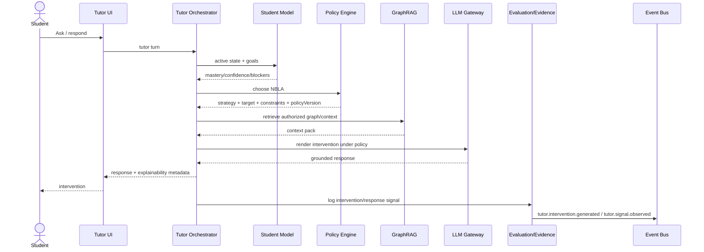

# BOOK-09A — Adaptive Tutor (ATA)
## DLU Architecture Standard — Annex to BOOK-09 (ACE)
### Version 1.0 — DRAFT for review

> The normative specification of the **Adaptive Tutor Architecture (ATA 1.0)** — a cross-cutting slice over the Academic
> Operating System that delivers a scalable adaptive tutor personalised from the learner's knowledge state, goals and
> evidence, improving a **versioned pedagogical policy** through governed learning loops.
> **Systematised from** the DLU Architecture Suite `DLU_EKG_Suite/ATA/` (DKA `600-adaptive-tutor/*`, DSA `250-tutor-platform/*`,
> DXA tutor patterns/screens, DPA adaptive-tutor). **Binds** ADR-0016 (pedagogy explicit & versioned) and ADR-0018 (tutor state
> external / stateless runtime). **Depends on** BOOK-06 (Student Twin), BOOK-09 (ACE), BOOK-11 (Cognitive Arch.), BOOK-12
> (Memory), BOOK-13 (Knowledge Network), BOOK-14 (GPS), BOOK-15 (Assessment/Evidence), BOOK-17 (Experiences), BOOK-19 (Governance).
> Conformance: **DAS-Intelligent** (Tutor platform + policy) → **DAS-Certified** (governed policy rollout + evaluation).

Normative language MUST/SHOULD/MAY per RFC 2119.

---

## Chapter 1 — Purpose, core principle and non-negotiables

**Purpose.** Define how DLU teaches each learner adaptively at scale, while improving its pedagogy from measured outcomes — without retraining the model per learner.

**Core principle.** The Tutor does **not** continuously retrain the LLM on each learner. It continuously updates the **Student Learning Digital Twin** and improves a **versioned Pedagogical Policy** using measured learning outcomes:

```text
Student State + Goal + EKG + Evidence + Pedagogical Policy
      → Next Best Learning Action (NBLA) → Tutor Intervention → Outcome → State update
```

**Eight non-negotiable design decisions.**
1. Tutor runtime is **stateless**; learner state is persisted externally (ADR-0018).
2. **Mastery and confidence are separate** measures.
3. A conversational turn creates only an **informal signal**; only **qualified evidence** updates high-stakes mastery.
4. Pedagogical strategy is **explicit and versioned**; the LLM does not autonomously own pedagogy (ADR-0016).
5. Optimisation targets **learning gain and retention**, not engagement alone.
6. Production policy changes require **offline evaluation + controlled rollout**.
7. Every recommendation is **explainable** from goal, knowledge state and graph dependencies.
8. All retrieval and memory access is **tenant- and learner-authorised**.

**Architecture map.** DKA answers *what the Tutor knows* (Student Learning Twin, pedagogical ontology, memory, evidence/misconceptions, EKG extension); DXA *how the learner experiences adaptation* (diagnosis, hints, remediation, explain-why, adaptive difficulty, plan); DSA *how it is built and scaled* (Orchestrator, Policy Engine, Student Model, Memory, GraphRAG, evaluation, APIs, events); DPA *what capabilities ship* (Adaptive/Diagnostic/Socratic/Practice Tutor + Learning Advisor).

---

## Chapter 2 — Student Learning Digital Twin

A canonical, machine-readable representation of the learner's **current educational state** — not a personality profile; it stores only learning-relevant state needed to plan, explain and evaluate interventions (BOOK-06 twin projection).

```text
StudentLearningTwin
├── identityRef
├── activeGoals[]            LearningGoal
├── masteryStates[]          MasteryState
├── misconceptionStates[]    MisconceptionState
├── prerequisiteReadiness[]  PrerequisiteReadiness
├── learningPreferences[]    LearningPreference
├── learningConstraints[]    LearningConstraint
├── recentEpisodes[]         LearningEpisode
├── recommendations[]        Recommendation
└── policyContext
```

| Entity | Key attributes | Notes |
|--------|----------------|-------|
| LearningGoal | goalId, type, targetUri, priority, deadline?, status | course · assessment · competency · career · learner-defined |
| MasteryState | subjectUri, **mastery**, **confidence**, evidenceCount, updatedAt | subject ∈ Concept/MLO/CLO/Skill |
| MisconceptionState | conceptUri, misconceptionType, probability, evidenceRefs | probabilistic; never shown as fact without confidence |
| PrerequisiteReadiness | targetUri, readiness, blockers[] | derived from EKG dependencies |
| LearningPreference | modality, verbosity, examplePreference, language | soft; never overrides academic requirements |
| LearningConstraint | availability, accessibility, pacing | learner-declared or system |
| LearningEpisode | intervention, response, outcome, timestamp | compact episodic record |

**Mastery semantics.** `mastery∈[0,1]` estimates capability; `confidence∈[0,1]` estimates reliability of that estimate. `mastery=.90,confidence=.25` ≠ `mastery=.90,confidence=.95`.

**Goal priority order (normative).** (1) Regulatory/safety/academic-progression constraints → (2) explicit current learner goal → (3) program/course outcome targets.

The twin is materialised by the **Student Model Service** (derived; owns no canonical data) and is rebuilt on `mastery.updated` and `tutor.*` events. The **browser never computes mastery** (BOOK-17).

---

## Chapter 3 — Pedagogical Strategy Ontology

The explicit strategy set the Policy Engine chooses from; the LLM renders within it.

| Strategy | Intent | Typical trigger |
|----------|--------|-----------------|
| EXPLAIN | introduce/clarify | low/unknown mastery |
| SIMPLIFY | reduce complexity | repeated confusion |
| ELABORATE | add depth/connections | medium mastery, high confidence |
| SCAFFOLD | split complex task | low prerequisite readiness |
| SOCRATIC_QUESTION | induce reasoning | Bloom Analyze/Evaluate target |
| WORKED_EXAMPLE | model a procedure | procedural concept, low mastery |
| HINT | preserve productive struggle | near-success attempt |
| PRACTICE | strengthen retrieval/application | adequate prerequisite readiness |
| REVIEW_PREREQUISITE | repair blocker | dependency gap |
| REMEDIATE | address persistent misconception | repeated evidence pattern |
| CHALLENGE | increase difficulty | high mastery/high confidence |
| REFLECT | metacognitive consolidation | after meaningful activity |
| ASSESS | collect qualified evidence | outcome checkpoint |
| REASSESS | verify remediation/retention | after intervention or time decay |

**LearningIntervention** properties: `strategy, targetUri, goalRef, difficulty, bloomTarget, estimatedEffort, maxHints, contentRefs, policyVersion, explanation`.

**Selection contract (normative).** The Pedagogical Policy Engine selects the strategy and constraints; the LLM realises the intervention within that policy; **a generated answer MUST NOT silently change the selected strategy.**

**Strategy-graph examples.** `REVIEW_PREREQUISITE→WORKED_EXAMPLE→PRACTICE→REASSESS` · `EXPLAIN→SOCRATIC_QUESTION→REFLECT` · `PRACTICE→HINT→HINT→WORKED_EXAMPLE` (on repeated failure).

---

## Chapter 4 — Pedagogical Policy Engine (NBLA)

Selects the **Next Best Learning Action**; the policy chooses pedagogy, the LLM renders it (ADR-0016).

**Context.** `studentState, activeGoal, targetConcept, prerequisiteReadiness, recentInterventions, assessmentEvidence, constraints`.

**Candidate actions.** the 14 strategies of Ch.3.

**Baseline score (versioned).**
`Score(a) = w1·ExpectedLearningGain + w2·GoalAlignment + w3·PrerequisiteReadiness + w4·GapPriority + w5·RetentionValue + w6·EngagementProbability − w7·CognitiveLoad − w8·Redundancy − w9·RiskPenalty`
Weights are **policy-versioned**, observable, configurable per program/tenant within governance bounds.

**Reward (illustrative, calibrate empirically).** learning gain 40% · delayed retention 20% · goal progress 15% · assessment improvement 10% · constructive engagement 10% · satisfaction 5%. **Engagement alone is never the target.**

**Learning evolution.** V1 rules+expert weights → V1.5 offline counterfactual evaluation + calibrated propensity logging → V2 contextual bandit for eligible low-risk choices → RL **only** after governance approval with a **constrained action space**.

**Deployment.** Draft → simulation → shadow → A/B or interleaving → academic review → approved → canary → production → monitor → rollback. `PolicyVersion` is immutable and auditable; every intervention records its `policyVersion` (`GENERATED_BY_POLICY`).

---

## Chapter 5 — Learning evidence & misconceptions

**Evidence classes.**
- **QualifiedEvidence** — graded quiz item, rubric-scored assignment, proctored/authenticated assessment. May update **assessed mastery** with normal weight.
- **TutorEvidence** — from a tutor micro-assessment; carries evaluator model/version, prompt, rubric, confidence. **Weight-capped unless validated**; **cannot override authoritative grades**.
- **InformalSignal** — conversation-derived clue (hesitation, explanation quality, repeated error). Used for **diagnosis/intervention planning only**; does not drive high-stakes mastery.

**Weighting.** `effectiveWeight = baseWeight × reliability × authenticity × recency × difficultyCalibration`.

**Misconception state** — a re-evaluable hypothesis:
```json
{ "conceptUri":"dlu:concept/semantic-search", "type":"confuses_with_keyword_search",
  "probability":0.74, "evidenceRefs":["ev:91","ev:104"], "status":"active" }
```
Re-evaluate after remediation; the Tutor says "It looks like…" rather than asserting a misconception as fact at low confidence.

---

## Chapter 6 — Tutor Memory (BOOK-12 profile)

**Stores.** Working memory (short-lived session, Redis-compatible) · Episodic memory (compact event/summary, **vector-indexed only after ACL tagging**) · Learning state (EKG + mastery service) · Preference memory (profile service, learner-editable).

**Retrieval filter.** Every query requires `tenantId, studentId, purpose, role, retentionClass`; retrieval is **policy-filtered before ranking**. Retrieved content is **data, not instructions**.

**Write policy.** Raw tutor messages are **not** auto-promoted to durable memory; a memory-extraction step proposes an item; schema, ACL, confidence and retention are validated before persistence.

**Deletion/rectification.** A preference correction invalidates derived preference embeddings; a learning-evidence correction follows academic-record governance and produces a **new version** (no silent overwrite where audit is required).

---

## Chapter 7 — Tutor Platform Architecture

Stateless, horizontally scalable workers; persistent state in EKG/mastery, memory and event stores (ADR-0018).

```text
Client → API Gateway → Tutor Orchestrator
                       ├─ Student Model Service
                       ├─ Goal Service
                       ├─ Pedagogical Policy Engine
                       ├─ GraphRAG Service → Neo4j + Vector Store
                       ├─ Memory Service
                       ├─ Mastery Engine
                       ├─ Tutor Evaluation Service
                       ├─ LLM Gateway
                       └─ Event Bus
```

| Service | Responsibility | Owns canonical data? |
|---------|----------------|----------------------|
| Tutor Orchestrator | session lifecycle & workflow | session metadata only |
| Student Model Service | materialised learning twin | no (derived) |
| Goal Service | learner/program/career goals | yes (goals) |
| Pedagogical Policy Engine | choose NBLA/strategy | policy definitions + decisions |
| GraphRAG Service | graph-aware retrieval | no |
| Memory Service | working/episodic/preference | yes (memory artifacts) |
| Mastery Engine | update mastery/confidence | mastery observations |
| Tutor Evaluation Service | intervention/outcome analytics | evaluation facts |
| LLM Gateway | routing, cost, guardrails | no learner state |

**Scaling.** State external → optional session affinity; Orchestrator and GraphRAG autoscale independently; cache immutable curriculum subgraphs and short-lived student projections; batch non-urgent mastery recompute; tenant-scoped rate limits and model budgets.
**Availability / degraded mode.** If Policy or GraphRAG is degraded, the Tutor **falls back to course-grounded, non-adaptive assistance** and labels personalisation temporarily unavailable.

---

## Chapter 8 — End-to-end sequences

**Adaptive tutoring turn.**


**Evidence-qualified response.** Orchestrator submits a candidate `TutorEvidence` to the Evidence Service → Mastery Engine applies capped weight (unless validated) → EKG updated as a superseding record; authoritative grades are never overwritten.

---

## Chapter 9 — EKG extension (register in `architecture/ontology/dlu-core.yaml`)

**New node types:** `LearningGoal, LearningIntervention, LearningStrategy, TutorSession, TutorTurn, LearningEpisode, Misconception, Recommendation, LearningPlan, TutorEvidence, PolicyVersion`.

**New edge types:**

| Edge | From → To | Cardinality |
|------|-----------|-------------|
| HAS_GOAL | Student → LearningGoal | 0..N |
| TARGETS | LearningGoal → Concept/MLO/CLO/Skill/JobRole | exactly 1 |
| HAS_SESSION | Student → TutorSession | 0..N |
| CONTAINS_TURN | TutorSession → TutorTurn | 1..N |
| USES_STRATEGY | LearningIntervention → LearningStrategy | exactly 1 |
| TARGETS_KNOWLEDGE | LearningIntervention → Concept/MLO/CLO/Skill | 1..N |
| PRODUCES_SIGNAL | TutorTurn → TutorEvidence | 0..N |
| SUPPORTS | TutorEvidence → MasteryObservation | 0..N |
| SUGGESTS | TutorEvidence → Misconception | 0..N |
| REMEDIATES | LearningIntervention → Misconception | 0..N |
| RECOMMENDS | LearningPlan → LearningIntervention | 1..N |
| GENERATED_BY_POLICY | LearningIntervention → PolicyVersion | exactly 1 |

**URIs.** `dlu:student/{id}/goal/{goalId}` · `dlu:tutor/session/{uuid}` · `dlu:tutor/intervention/{uuid}` · `dlu:pedagogy/strategy/WORKED_EXAMPLE` · `dlu:tutor/policy/{version}`.

**Neo4j constraints (excerpt).**
```cypher
CREATE CONSTRAINT learning_goal_id IF NOT EXISTS FOR (n:LearningGoal) REQUIRE n.id IS UNIQUE;
CREATE CONSTRAINT tutor_session_id IF NOT EXISTS FOR (n:TutorSession) REQUIRE n.id IS UNIQUE;
CREATE CONSTRAINT intervention_id IF NOT EXISTS FOR (n:LearningIntervention) REQUIRE n.id IS UNIQUE;
CREATE CONSTRAINT policy_version_id IF NOT EXISTS FOR (n:PolicyVersion) REQUIRE n.id IS UNIQUE;
```
**Invariants:** `LearningGoal TARGETS` exactly one knowledge node; `LearningIntervention GENERATED_BY_POLICY` exactly one `PolicyVersion`; `TutorEvidence` may `SUPPORTS` a `MasteryObservation` but cannot override authoritative grades; `PolicyVersion` is immutable.

---

## Chapter 10 — Tutor Evaluation Framework

**Layers.** (a) **Response quality** — grounding, correctness, policy compliance, clarity, safety, citation integrity; (b) **Learning effectiveness** — immediate gain, delayed retention, transfer, goal progress, remediation success; (c) **System performance** — P50/P95 latency, token cost/session, graph-retrieval latency, policy-decision latency, fallback rate; (d) **Fairness & robustness** — outcome gaps by authorised cohorts, differential recommendation rates, accessibility, language quality, drift.

**Experiment unit.** Default is **learner or course section**, not individual message (reduces contamination).

**Minimum release gates.** No regression in grounding/correctness · statistically **and** educationally meaningful learning effect for any improvement claim · no material increase in high-risk/ungrounded responses · approved academic owner + rollback plan.

**Observability IDs (per turn).** `sessionId, turnId, policyVersion, modelRoute, contextPackId, interventionId, correlationId`.

---

## Chapter 11 — Governance, security & compliance (BOOK-19 profile)

- **Pedagogical-policy governance** = the deployment lifecycle of Ch.4 with academic review, canary and rollback; `PolicyVersion` audited.
- **Authorisation.** RBAC + ABAC; memory/retrieval tenant- and learner-scoped; agents receive short-lived, scope-reduced delegated tokens; LLM sees only policy-approved context.
- **EU AI Act.** Adaptive steering of learning is an Annex III high-risk function: risk management, logging (observability IDs), transparency, human oversight and accuracy monitoring are compliance requirements, not aspirations.
- **Integrity.** Turn = informal signal; TutorEvidence cannot override grades (ADR-0018); corrections supersede, never overwrite.

---

## Chapter 12 — Contracts (DSA)

REST `tutor-openapi.yaml`; GraphQL `tutor-schema.graphql` (read-heavy tutor projections, controlled mutations); events `tutor-asyncapi.yaml` + `tutor-event-envelope.schema.json` (`dlu.tutor.session.*`, `dlu.tutor.intervention.generated`, `dlu.tutor.signal.observed`, `dlu.tutor.policy.*`); reference `reference-tutor-queries.cypher`. All on the closed event taxonomy and the governed LLM gateway.

---

## Chapter 13 — Experience (BOOK-17 profile)

Screens **stu_13 tutor-session**, **stu_14 learning-diagnosis**, **stu_15 personal-learning-plan**; AI-interaction patterns **AIP-11 Socratic dialogue, AIP-12 hint ladder, AIP-13 remediation, AIP-14 adaptive difficulty, AIP-15 tutor diagnostic, AIP-16 explain-why-next-action**. All under the Lens rules: progressive disclosure, **mastery ≠ confidence** visuals, bounded local graph; Paper Design 3.0 + component library; learner language, not ontology labels; explain-why on every recommendation.

---

## Chapter 14 — KPIs (feed BOOK-00 Ch.14)

Learning gain per intervention; delayed retention; goal progress rate; remediation success; grounding rate (target high); policy-decision latency; fallback rate; mentorship-preserving balance (tutor absorbs routine, humans gain time); disparate-impact deltas across cohorts. **Engagement is never the north-star.**

---

## Chapter 15 — Implementation, conformance & non-goals

**Turnkey sprints (Claude Code):** `EKG-W3-06` ATA EKG extension · `EKG-W3-07` Student Model Service · `EKG-W3-08` Pedagogical Policy Engine · `EKG-W3-09` Tutor Memory · `EKG-W3-10` Orchestrator + Evaluation (`dlu_builder_tk/docs/ROOCODE_EKG_PROMPTS.md`, skill `ekg-tutor`).

**Conformance.** DAS-Intelligent requires the stateless Tutor platform, versioned Policy Engine, Student Learning Twin and evidence tiering. DAS-Certified additionally requires the governed policy rollout, the evaluation framework gates and the AI-Act mapping.

**Non-goals.** ATA is NOT a per-learner LLM fine-tuning system; NOT a replacement for authoritative assessment; NOT an autonomous pedagogy owner; NOT an engagement-maximiser.

**Reference lifecycle.** `Expert policy → instrumented pilot → evidence collection → offline policy evaluation → controlled experiment → approved policy version → production rollout → monitoring.`

---

*BOOK-09A v1.0 — awaiting review. Source: DLU Architecture Suite ATA 1.0. Binds ADR-0016/0018; adopts Course Format v2.0 (ADR-0017) as the authoring substrate for tutor-grounded content.*
