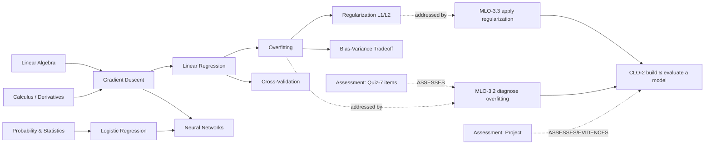

# Il grafo della conoscenza educativa come nucleo cognitivo dell'AI-Native University
### Un punto di vista scientifico, architetturale e pedagogico sul DLU Educational Knowledge Graph (EKG)

*Position paper — edizione scientifica · DLU Architecture Board · agosto 2026*
*Riferimenti interni: BOOK-00/05/09A/13/15, EKG Ontology 1.0, EKG 1.1 Production Architecture, ATA 1.0, DXA Lens Guide. Riferimenti scientifici: §8.*

---

## Abstract

Introdurre l'IA come strato sopra LMS/SIS produce un'amministrazione più veloce di un modello invariato. DLU adotta un'ipotesi diversa: collocare al centro non il contenuto ma **la conoscenza rappresentata come grafo**, formalmente modellata e probabilisticamente tracciata. Il **DLU Educational Knowledge Graph (EKG)** è la spina dorsale semantica che rende comprensibili alla macchina curriculum, esiti, concetti, competenze, valutazioni, evidenze, padronanza e traiettorie. La tesi è che l'EKG costituisca il **nucleo cognitivo e l'intelligenza didattica** del sistema, e che due decisioni di modellazione — (i) rappresentare i prerequisiti come **grafo di dipendenze** (DAG) e (ii) stimare la conoscenza come **stato latente probabilistico con incertezza esplicita** (padronanza ≠ fiducia) — abbiano fondamento nella letteratura di *knowledge tracing*, *learning analytics* e scienza dell'apprendimento. Il documento formalizza il modello dello studente, presenta un **caso reale** (grafo della conoscenza di un corso di Machine Learning), e mostra numericamente **come si costruisce la conoscenza sullo studente** e **come l'aggregato dello stato di apprendimento alimenta i casi d'uso dei docenti**.

---

## 1. Motivazione e fondamento scientifico

Bloom (1984) documentò che il *mastery learning* con tutoring individuale sposta la distribuzione degli esiti di ~2 deviazioni standard rispetto all'aula tradizionale — un effetto storicamente insostenibile per costo, che l'IA rende oggi avvicinabile [Bloom 1984]. Rendere operativo il *mastery learning* richiede però tre ingredienti misurabili che l'università classica lascia impliciti: (a) una **rappresentazione della struttura della conoscenza** (cosa dipende da cosa), (b) una **stima dello stato dell'apprendente** aggiornata dall'evidenza, (c) un **allineamento costruttivo** esito–attività–evidenza dichiarato prima del contenuto [Biggs 1996].

- La struttura della conoscenza come **grafo con relazioni di prerequisito** è la forma canonica degli *Educational Knowledge Graph*: un prerequisito A→B significa che A va padroneggiato prima di B, e i cammini nel grafo diventano percorsi di apprendimento e strumenti diagnostici [Chen et al. 2018 (KnowEdu); Abu-Salih 2021]. Rappresentare i prerequisiti come **DAG** riflette l'idea vygotskiana di *zona di sviluppo prossimale*: l'intervento efficace agisce sui concetti pronti dato lo stato corrente [Vygotsky 1978].
- La **stima dello stato latente** ha una tradizione consolidata: il *Bayesian Knowledge Tracing* modella la padronanza per-skill come HMM a due stati con quattro parametri (prior, learn, guess, slip) [Corbett & Anderson 1995]; le sue estensioni logistiche (PFA, IRT, Elo) e le reti neurali (*Deep Knowledge Tracing*) ne ampliano potenza e flessibilità [Pelánek 2017; Piech et al. 2015; Abdelrahman et al. 2023]. DLU adotta un modello **bayesiano a posteriori Beta** — più semplice di BKT da spiegare, ma che, a differenza del BKT classico, **espone l'incertezza** della stima (la varianza della Beta), realizzando un *open learner model* ispezionabile e contestabile [Bull & Kay 2010].
- La **fisica della memoria** (curva dell'oblio di Ebbinghaus; *testing effect*; *desirable difficulties*) motiva il decadimento temporale e la scelta di attività effortful: ripetizione dilazionata e recupero attivo migliorano la ritenzione a lungo termine [Ebbinghaus 1885; Roediger & Karpicke 2006; Bjork & Bjork 2011; Settles & Meeder 2016].

La conseguenza progettuale è netta: **la progressione è guidata dall'evidenza, non dal tempo trascorso**, e l'unità di verità è lo stato latente `(padronanza, fiducia)` per concetto, propagato lungo il grafo verso MLO/CLO e competenze.

---

## 2. Il modello formale dello studente in DLU

### 2.1 Evidenza e sua pesatura
Ogni attività produce un'**evidenza** con punteggio normalizzato `s ∈ [0,1]` e un peso efficace che combina qualità dello strumento, affidabilità del valutatore, recenza e autenticità:

```
w_e = quality · reliability · recency · authenticity          (peso dell'evidenza)
effectiveWeight = baseWeight · reliability · authenticity · recency · difficultyCalibration
```

DLU distingue tre classi (BOOK-15/ADR-0018): **QualifiedEvidence** (item valutato, rubrica, prova autenticata) aggiorna la padronanza ad alto rischio; **TutorEvidence** (micro-assessment del tutor) ha peso *capped*; **InformalSignal** (esitazione, qualità della spiegazione) guida solo diagnosi e pianificazione. *TutorEvidence non può sovrascrivere i voti autoritativi.*

### 2.2 Stima della padronanza (posteriori Beta)
Per la coppia (apprendente `u`, target `k`) si mantiene una Beta `(α,β)`. Con evidenza `(s, w_e)`:

```
α ← α + w_e · s
β ← β + w_e · (1 − s)

M   = α / (α + β)                        (padronanza attesa)
Var = αβ / ((α+β)² (α+β+1))              (incertezza)
C   = 1 − 2·√Var   (clip a [0,1])         (fiducia = 1 − 2·SD)   [una possibile mappatura]
```

`M` e `C` **non vanno mai collassati**: `(M=.90, C=.25)` ("promettente ma poco evidenziato") è diverso da `(M=.90, C=.95)` ("forza stabile") [Bull & Kay 2010]. Il decadimento temporale è applicato a *query-time* sulle osservazioni immutabili (analogo alla forgetting curve/HLR) [Settles & Meeder 2016].

> *Relazione con BKT.* Il BKT stima `P(L)` via HMM con guess/slip [Corbett & Anderson 1995]. La formulazione Beta è una sua parente coniugata in cui `slip/guess` sono assorbiti in `w_e·s`; il valore aggiunto è la **varianza esplicita** come misura di fiducia — assente nel BKT a singolo valore e cruciale per decidere *quando servono più evidenze prima di raccomandare*.

### 2.3 Propagazione gerarchica e prontezza sui prerequisiti
La padronanza di concetto si propaga verso MLO→CLO→Skill con pesi `π` e viene **limitata** dalla prontezza dei prerequisiti (DAG):

```
readiness(k) = Π_{p ∈ prereq(k)}  E(p)                      (cap moltiplicativo)
M(MLO_j) = ( Σ_k π_{jk} · M(k) )  ·  min(1, readiness(MLO_j))
```

dove `E` è la **padronanza efficace** confidence-sensitive:

```
E = M · ( γ + (1 − γ)·C ),   γ ∈ [0,1]                       (sconto per incertezza)
gap(target) = max(0, target − E)
```

### 2.4 Selezione dell'azione didattica (Adaptive Tutor)
La *Pedagogical Policy Engine* (ATA/ADR-0016) sceglie la **Next Best Learning Action** massimizzando un punteggio versionato; l'LLM realizza, non decide:

```
Score(a) = w1·ExpectedLearningGain + w2·GoalAlignment + w3·PrerequisiteReadiness
         + w4·GapPriority + w5·RetentionValue + w6·EngagementProbability
         − w7·CognitiveLoad − w8·Redundancy − w9·RiskPenalty
```

L'obiettivo è **guadagno di apprendimento e ritenzione**, non l'ingaggio; i cambi di policy passano da valutazione offline e rollout controllato.

### 2.5 Ottimizzazione del percorso (Academic GPS)
Il percorso deterministico ordina gli item per utilità marginale:

```
utility(item) = gapCoverage · expectedGain · confidenceNeed · relevance
              − timePenalty − redundancyPenalty
```

*(gli LLM narrano il percorso; non lo ordinano — separazione tra ranking deterministico e generazione, BOOK-14.)*

---

## 3. Caso reale: il grafo della conoscenza di un corso di Machine Learning

Consideriamo **AI-501 — Foundations of Machine Learning** (EQF 7). Estratto del sottografo dei concetti (nodi `Concept`) con relazioni `PREREQUISITE_OF` (DAG), l'ancoraggio agli esiti (`MLO`/`CLO`) e alle valutazioni (`Assessment`). Costruzione dei concetti/prerequisiti automatizzabile con tecniche note (estrazione di concetti + mining di prerequisiti) [Chen et al. 2018; ACE 2024].



Semantica EKG sottostante (estratto): `Course AI-501 —HAS_MODULE→ Module-3 —HAS_LESSON→ Lesson-3.2 —TEACHES→ Concept:Overfitting`; `Lesson-3.2 —ADDRESSES→ MLO-3.2 —CONTRIBUTES_TO→ CLO-2`; `Quiz-7.item —ASSESSES→ MLO-3.2`; `Evidence(project) —EVIDENCES→ CLO-2`; `Concept:LinearRegression —PREREQUISITE_OF→ Concept:Overfitting`. Il vincolo di **aciclicità** dei prerequisiti è un invariante di grafo verificato in CI (BOOK-13; ER_MAP_TARGET §2).

---

## 4. Caso d'uso A — Come si costruisce la conoscenza sullo studente (worked example)

Studente *u* sul concetto **Overfitting**. Prior non informativo `α₀=β₀=1` (⇒ `M=0.5`, alta incertezza). Tre evidenze durante il modulo 3:

| # | Attività | classe | s | w_e | Δα (=w_e·s) | Δβ (=w_e·(1−s)) |
|---|----------|--------|---|-----|-------------|-----------------|
| 1 | Quiz-7 item MCQ (corretto) | Qualified | 1.0 | 0.8 | 0.80 | 0.00 |
| 2 | Quiz-7 item (errato) | Qualified | 0.0 | 0.7 | 0.00 | 0.70 |
| 3 | Risposta aperta rubric-scored (buona) | Qualified | 0.9 | 1.0 | 0.90 | 0.10 |

Posteriori: `α = 1+0.80+0.90 = 2.70`, `β = 1+0.70+0.10 = 1.80`.

```
M   = 2.70 / 4.50 = 0.600
Var = (2.70·1.80) / (4.50² · 5.50) = 4.86 / 111.375 = 0.0436  → SD = 0.209
C   = 1 − 2·0.209 = 0.582
```

**Padronanza efficace** (γ=0.5): `E = 0.600 · (0.5 + 0.5·0.582) = 0.600 · 0.791 = 0.474`. Verso il target `0.75`: `gap = 0.276`.

**Effetto dei prerequisiti.** Se la readiness dei prerequisiti a monte è alta — `E(LinearRegression)=0.82`, `E(GradientDescent)=0.88` — la propagazione verso **MLO-3.2 "diagnose overfitting"** non viene limitata: `readiness(MLO-3.2)=min(1, 0.82·0.88)=0.72`; con `M(Overfitting)=0.60`, `M(BiasVariance)=0.55` e pesi `π=[0.6,0.4]`: `M(MLO-3.2)= (0.6·0.60+0.4·0.55)·0.72 = 0.58·0.72 = 0.418`. Se invece `LinearRegression` fosse debole (`E=0.40`), il cap scende (`readiness≈0.35`) e il sistema **attribuisce la debolezza al prerequisite**, non al concetto corrente — la base della diagnosi docente (§5).

**Azione del tutor.** Con `gap` medio-alto su Overfitting e prerequisiti *pronti*, la policy privilegia `WORKED_EXAMPLE → PRACTICE → REASSESS`; se i prerequisiti fossero deboli, privilegerebbe `REVIEW_PREREQUISITE` (Score con `w3·PrerequisiteReadiness` dominante). La scelta è **spiegabile** (goal + stato + dipendenze di grafo) e ancorata alle risorse via GraphRAG [Edge et al. 2024], con guadagno di apprendimento come obiettivo [Roediger & Karpicke 2006].

Ogni passo aggiorna osservazioni immutabili; l'evento `mastery.updated` ricostruisce la proiezione di lettura dello studente (BOOK-06). Lo studente **vede e può contestare** il proprio stato `(M,C)` per concetto — open learner model [Bull & Kay 2010].

---

## 5. Caso d'uso B — Come l'aggregato dello stato di apprendimento serve i docenti

Il docente non lavora sul singolo turno ma sull'**aggregato** degli stati di apprendimento della coorte, proiettato in una *Faculty Lens* (mai il grafo intero, ADR-0020).

### 5.1 Salute degli esiti (outcome health)
Per un esito `o` e coorte di `N` studenti si definiscono attainment e fiducia media:

```
Attainment(o) = (1/N) · Σ_u  1[ E_u(o) ≥ target(o) ]
MeanConfidence(o) = (1/N) · Σ_u  C_u(o)
```

Un esito con **attainment basso e MeanConfidence alta** è un *gap confermato* (intervento prioritario); **attainment ambiguo con confidence bassa** segnala *sotto-evidenziazione* → serve più valutazione, non ri-didattica. È la traduzione operativa di "padronanza ≠ fiducia" a livello di coorte.

### 5.2 Analisi di causa radice sul grafo dei prerequisiti
Selezionando un CLO debole (es. CLO-2), il sistema **decompone** lungo `CONTRIBUTES_TO` verso gli MLO, poi verso i concetti, e calcola per ogni concetto-prerequisito `p` un punteggio di **attribuzione** (dove si interrompe il trasferimento):

```
Blame(p) = frazione_studenti_bloccati_da(p) · centralità_prereq(p) · (target − mean E(p))₊
frazione_bloccati(p) = (1/N) · Σ_u  1[ readiness_u(child(p)) capped by E_u(p) < θ ]
```

Il docente riceve una spiegazione ordinata — *MLO contribuenti → concetti → prerequisiti a maggior Blame → copertura delle valutazioni → fiducia dell'evidenza* — invece di un esploratore di grafi generico. Esempio: se il 60% degli studenti con CLO-2 debole ha `E(LinearRegression) < 0.5`, il **Blame** più alto ricade su *Linear Regression*: la remediation efficiente è a monte, non su "overfitting".

### 5.3 Validità e copertura della valutazione
L'EKG verifica invarianti di *constructive alignment* [Biggs 1996]:

```
Coverage_outcomes = |{ o : ∃ Assessment ASSESSES o }| / |outcomes_pubblicati|
```

e, a livello di item, la **discriminazione** segnala domande deboli (point-biserial tra esito dell'item e punteggio totale):

```
r_pb = ( M₁ − M₀ ) / s_x · √( p·(1−p) )
```

con `p` proporzione di risposte corrette. Item a `r_pb` bassa o negativa vanno revisionati; questo dialoga con la teoria psicometrica (IRT 2PL: parametri di *difficoltà* `b` e *discriminazione* `a`) usata per calibrare gli item [Lord 1980; van der Linden & Hambleton 1997]. Il risultato: il docente **controlla il trasferimento della conoscenza** su quattro leve — salute degli esiti, causa radice sui prerequisiti, validità/copertura della valutazione, copertura dei contenuti — mantenendo l'autorità pedagogica (gli agenti operano entro envelope ispezionabili, BOOK-07).

### 5.4 Dal docente al programma e all'istituzione
Le stesse strutture salgono di scala: matrici **Corso×Esito**/**Corso×Competenza**, integrità dei prerequisiti e concetti orfani per il preside; tracciabilità **Programma→CLO→MLO→Lezione→Valutazione→Evidenza** come *vista* per il rettore, che alimenta gli indicatori AVA/DM 1154 (accreditamento) — controlli continui anziché annuali.

---

## 6. Perché queste scelte, in sintesi scientifica

| Scelta DLU | Fondamento | Riferimenti |
|------------|-----------|-------------|
| Prerequisiti come **DAG** interrogabile | struttura di prerequisito degli EKG; ZPD | [Chen 2018; Vygotsky 1978] |
| Stato latente `(M,C)` **con incertezza** | knowledge tracing + open learner model | [Corbett & Anderson 1995; Pelánek 2017; Bull & Kay 2010] |
| Progressione **evidence-driven** (mastery) | 2-sigma / mastery learning | [Bloom 1984] |
| **Decadimento** temporale, pratica dilazionata | forgetting curve, HLR, testing effect | [Ebbinghaus 1885; Settles & Meeder 2016; Roediger & Karpicke 2006] |
| Attività **effortful**, non frictionless | desirable difficulties | [Bjork & Bjork 2011] |
| **Constructive alignment** esito→attività→evidenza | allineamento didattico | [Biggs 1996] |
| Tutoring **ancorato al grafo** (GraphRAG), pedagogia esplicita | RAG su knowledge graph; efficacia del tutoring | [Edge 2024; VanLehn 2011] |
| Neurale opzionale (DKT) come *stimatore*, non come verità pedagogica | DKT e limiti d'interpretabilità | [Piech 2015; Abdelrahman 2023] |

Nota di onestà epistemica: DKT ottiene forte potere predittivo ma è meno interpretabile; DLU lo ammette come **fonte di stima** entro il motore bayesiano governato, mai come proprietario della pedagogia (ADR-0016).

## 7. Conclusione

Rappresentare la conoscenza come grafo e lo studente come stato latente incerto non è un vezzo ingegneristico: è la condizione per rendere operative, su scala, teorie consolidate dell'apprendimento. Per lo studente l'EKG è specchio e guida (open learner model + tutoring adattivo); per il docente è lo strumento che rende **osservabile e governabile il trasferimento della conoscenza** (outcome health, causa radice sui prerequisiti, validità della valutazione); per programma e istituzione è assicurazione di integrità e prova di attainment. È, propriamente, **l'intelligenza didattica** dell'AI-Native University.

---

## 8. Riferimenti

- Bloom, B. S. (1984). *The 2 Sigma Problem: The Search for Methods of Group Instruction as Effective as One-to-One Tutoring.* Educational Researcher, 13(6), 4–16.
- Corbett, A. T., & Anderson, J. R. (1995). *Knowledge Tracing: Modeling the Acquisition of Procedural Knowledge.* User Modeling and User-Adapted Interaction, 4, 253–278. [scirp ref](https://www.scirp.org/reference/referencespapers?referenceid=3799359)
- Pelánek, R. (2017). *Bayesian Knowledge Tracing, Logistic Models, and Beyond: An Overview of Learner Modeling Techniques.* User Modeling and User-Adapted Interaction, 27, 313–350. [Springer](https://link.springer.com/article/10.1007/s11257-017-9193-2) · [PDF](https://www.fi.muni.cz/~xpelanek/publications/umuai-overview.pdf)
- Piech, C., Bassen, J., Huang, J., Ganguli, S., Sahami, M., Guibas, L., & Sohl-Dickstein, J. (2015). *Deep Knowledge Tracing.* NeurIPS 2015. [NIPS](https://papers.nips.cc/paper/5654-deep-knowledge-tracing) · [arXiv:1506.05908](https://arxiv.org/pdf/1506.05908)
- Abdelrahman, G., Wang, Q., & Nunes, B. (2023). *Knowledge Tracing: A Survey.* (Models, Variants, Applications). [arXiv:2105.15106](https://arxiv.org/pdf/2105.15106)
- Chen, P., Lu, Y., Zheng, V. W., Chen, X., & Yang, B. (2018). *KnowEdu: A System to Construct Knowledge Graph for Education.* IEEE Access. [IEEE Xplore](https://ieeexplore.ieee.org/document/8362657/) · [PDF](https://www.researchgate.net/publication/325303797_KnowEdu_A_System_to_Construct_Knowledge_Graph_for_Education)
- *ACE: AI-Assisted Construction of Educational Knowledge Graphs with Prerequisite Relations.* Journal of Educational Data Mining (2024). [JEDM](https://jedm.educationaldatamining.org/index.php/JEDM/article/view/737)
- Abu-Salih, B. (2021). *Domain-specific Knowledge Graphs: A Survey.* [arXiv:2011.00235](https://arxiv.org/pdf/2011.00235)
- Biggs, J. (1996). *Enhancing Teaching through Constructive Alignment.* Higher Education, 32, 347–364.
- Vygotsky, L. S. (1978). *Mind in Society: The Development of Higher Psychological Processes.* Harvard University Press.
- Roediger, H. L., & Karpicke, J. D. (2006). *Test-Enhanced Learning: Taking Memory Tests Improves Long-Term Retention.* Psychological Science, 17, 249–255. [SAGE](https://journals.sagepub.com/doi/10.1111/j.1467-9280.2006.01693.x) · [PubMed](https://pubmed.ncbi.nlm.nih.gov/16507066/)
- Bjork, E. L., & Bjork, R. A. (2011). *Making Things Hard on Yourself, but in a Good Way: Creating Desirable Difficulties to Enhance Learning.*
- Ebbinghaus, H. (1885). *Über das Gedächtnis (Memory: A Contribution to Experimental Psychology).*
- Settles, B., & Meeder, B. (2016). *A Trainable Spaced Repetition Model for Language Learning.* ACL 2016, 1848–1858. [ACL Anthology](https://aclanthology.org/P16-1174/) · [PDF](https://research.duolingo.com/papers/settles.acl16.pdf)
- Bull, S., & Kay, J. (2010). *Open Learner Models.* In Advances in Intelligent Tutoring Systems (Springer).
- Edge, D., Trinh, H., Cheng, N., Bradley, J., Chao, A., Mody, A., Truitt, S., Metropolitansky, D., Ness, R. O., & Larson, J. (2024). *From Local to Global: A Graph RAG Approach to Query-Focused Summarization.* [arXiv:2404.16130](https://arxiv.org/abs/2404.16130)
- VanLehn, K. (2011). *The Relative Effectiveness of Human Tutoring, Intelligent Tutoring Systems, and Other Tutoring Systems.* Educational Psychologist, 46(4), 197–221.
- Lord, F. M. (1980). *Applications of Item Response Theory to Practical Testing Problems.* · van der Linden, W. J., & Hambleton, R. K. (1997). *Handbook of Modern Item Response Theory.*

*Nota: le formule sono illustrative e calibrabili sui dati DLU; i pesi (`w_i`, `π`, `γ`) e le soglie sono parametri versionati e governati (rule pack), non costanti hard-coded.*
