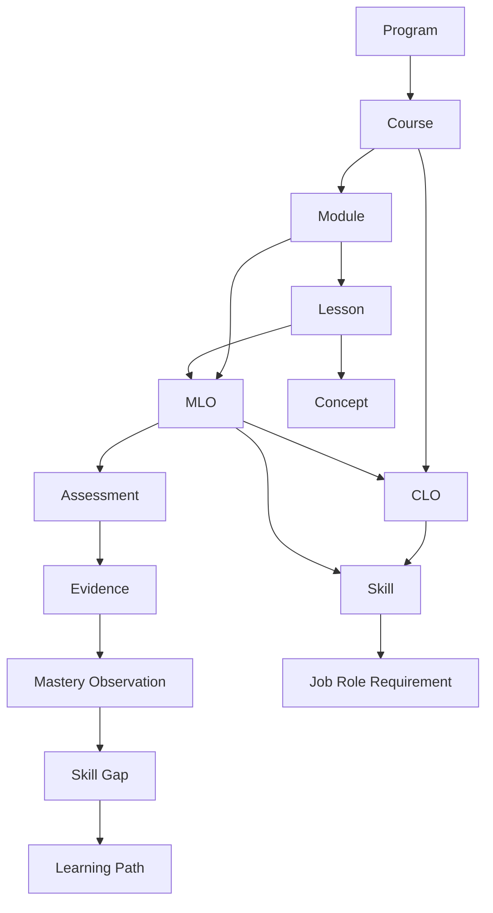
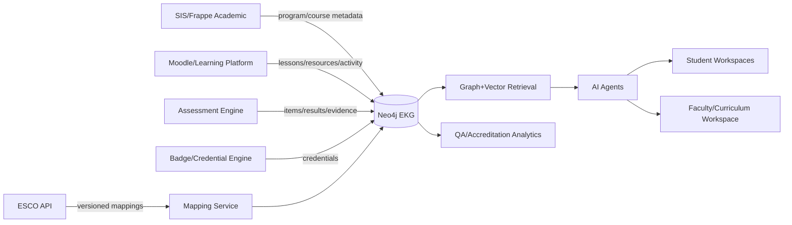

# DLU Educational Knowledge Graph (EKG) Ontology 1.0
**Technical Architecture & Implementation Blueprint**  
Version: 1.0 Draft for Architecture / Engineering  
Date: 8 August 2026  
Status: Implementation Blueprint
## 1. Executive intent
The DLU EKG is the semantic backbone that connects curriculum, knowledge, skills, assessment evidence, learner mastery, career targets, and AI-driven learning actions. The canonical model is owned by DLU; external frameworks are linked through versioned mapping assertions rather than copied into the core ontology.
### Design principles
- Stable DLU URIs and versioned entities.
- Outcomes are first-class graph nodes; CLO/MLO are specialisations of LearningOutcome.
- Evidence and mastery are temporal and provenance-aware.
- External mappings are reviewable assertions, never silent equivalences.
- Property graph is the operational store; JSON-LD/OWL provide semantic portability.
- Vector search complements, but never replaces, graph relationships.
- AI recommendations must preserve explainability paths back to evidence, outcomes and prerequisites.
## 2. Standards alignment
- 1EdTech CASE 1.1: framework/items/associations/rubrics interoperability.
- ESCO: URI-based skills and occupations; imported as external framework concepts.
- SFIA: professional skill responsibility levels; referenced via mappings.
- DigComp 2.2: digital competence areas/competences as external concepts.
- EQF: qualification level descriptors.
- Bloom: cognitive process classification of learning outcomes.
## 3. Layered ontology

## 4. Node Types
| Node Type | Layer | Semantics | Core attributes |
|---|---|---|---|
| Institution | Academic | Higher-education provider or organizational root | id, uri, name, country, status, version |
| School | Academic | Academic school/faculty | id, uri, name, status |
| Program | Academic | Degree or credential program | id, uri, code, title, ects, eqfLevel, version, status |
| Course | Academic | Credit-bearing course | id, uri, code, title, ects, level, language, version, status |
| Module | Academic | Coherent course unit | id, uri, code, title, sequence, workloadHours |
| Lesson | Academic | Atomic instructional unit | id, uri, title, sequence, durationMinutes, modality |
| LearningResource | Academic | Content/resource used for learning | id, uri, title, resourceType, mediaType, language, sourceUri |
| LearningOutcome | Academic | Canonical superclass for outcomes | id, uri, statement, outcomeType, bloomLevel, targetMastery, version, status |
| CLO | Academic | Course Learning Outcome; subtype of LearningOutcome | id, uri, statement, bloomLevel, targetMastery |
| MLO | Academic | Module Learning Outcome; subtype of LearningOutcome | id, uri, statement, bloomLevel, targetMastery |
| Concept | Knowledge | Knowledge concept or topic | id, uri, prefLabel, definition, conceptType, difficulty, version |
| KnowledgeUnit | Knowledge | Reusable cluster of related concepts | id, uri, title, description |
| ToolTechnology | Knowledge | Tool, framework, platform, model or technology | id, uri, name, category, versionHint |
| Dataset | Knowledge | Dataset used in learning or assessment | id, uri, name, license, sourceUri |
| Skill | Competency | Canonical DLU skill | id, uri, prefLabel, description, skillType, proficiencyScale |
| FrameworkConcept | Competency | External framework concept wrapper | id, uri, framework, externalUri, externalId, prefLabel, version |
| QualificationLevel | Competency | Level descriptor, e.g. EQF | id, uri, framework, level, descriptor |
| Assessment | Assessment | Assessment container | id, uri, code, title, assessmentType, weight, maxScore, summative |
| AssessmentItem | Assessment | Atomic question/task | id, uri, itemType, promptRef, maxScore, difficulty |
| Rubric | Assessment | Scoring rubric | id, uri, title, version |
| RubricCriterion | Assessment | Rubric dimension | id, uri, title, description, weight |
| PerformanceLevel | Assessment | Rubric achievement band | id, uri, label, ordinal, minScore, maxScore, descriptor |
| Evidence | Assessment | Evidence produced by learner | id, uri, evidenceType, artifactUri, timestamp, provenance |
| Credential | Assessment | Badge/microcredential/credential | id, uri, title, credentialType, issuer, issueDate, expiryDate |
| Learner | Learner | Person or pseudonymous learner entity | id, uri, externalRef, cohort, privacyClass |
| MasteryObservation | Learner | Time-stamped mastery observation | id, uri, score, confidence, observedAt, sourceType, algorithmVersion |
| LearningState | Learner | Materialized learner state snapshot | id, uri, computedAt, stateVersion |
| JobRole | Career | Target occupation/job family | id, uri, title, description, framework, externalUri |
| CareerPath | Career | Ordered career progression | id, uri, title, description |
| SkillRequirement | Career | Reified skill requirement for a role | id, uri, requiredLevel, importance, source, validFrom, validTo |
| GapObservation | Career | Computed learner-to-target skill gap | id, uri, gap, priority, computedAt, algorithmVersion |
| LearningPath | AI | Personalized or canonical path | id, uri, title, pathType, generatedAt, algorithmVersion, status |
| LearningPathStep | AI | Ordered path step | id, uri, sequence, rationale, status, dueAt |
| Recommendation | AI | AI recommendation with provenance | id, uri, recommendationType, score, rationale, generatedAt, modelId |
| Agent | AI | Logical AI service/agent | id, uri, name, agentType, version, policyProfile |
| PolicyRule | Governance | Machine-readable governance/validation rule | id, uri, ruleType, severity, expression, version |
| MappingAssertion | Governance | Versioned mapping between internal/external concepts | id, uri, mappingType, confidence, status, reviewer, reviewedAt |

## 5. Edge Types and cardinalities
| Edge | From | To | Source cardinality | Target cardinality | Semantics |
|---|---|---|---|---|---|
| HAS_SCHOOL | Institution | School | 1 | 0..* | Ownership/composition |
| OFFERS_PROGRAM | School | Program | 1 | 0..* | Academic ownership |
| HAS_COURSE | Program | Course | 1 | 1..* | Curriculum composition |
| HAS_MODULE | Course | Module | 1 | 1..* | Course composition |
| HAS_LESSON | Module | Lesson | 1 | 1..* | Module composition |
| USES_RESOURCE | Lesson | LearningResource | 0..* | 0..* | Instructional resource alignment |
| DEFINES_CLO | Course | CLO | 1 | 1..* | Outcome definition |
| DEFINES_MLO | Module | MLO | 1 | 1..* | Outcome definition |
| CONTRIBUTES_TO | MLO | CLO | 1..* | 1..* | Outcome alignment |
| ADDRESSES | Lesson | MLO | 1..* | 1..* | Lesson-outcome coverage |
| TEACHES | Lesson | Concept | 1..* | 1..* | Content-concept coverage |
| HAS_CONCEPT | KnowledgeUnit | Concept | 1..* | 1..* | Concept grouping |
| PREREQUISITE_OF | Concept | Concept | 0..* | 0..* | Directed acyclic prerequisite relation |
| RELATED_TO | Concept | Concept | 0..* | 0..* | Symmetric semantic relation |
| PART_OF | Concept | Concept | 0..* | 0..1 | Mereological relation |
| USES_TECHNOLOGY | Lesson | ToolTechnology | 0..* | 0..* | Technology usage |
| USES_DATASET | Lesson | Dataset | 0..* | 0..* | Dataset usage |
| DEVELOPS | LearningOutcome | Skill | 1..* | 0..* | Outcome-skill alignment |
| MAPS_TO_FRAMEWORK | Skill | FrameworkConcept | 0..* | 0..* | External framework mapping via assertion preferred |
| HAS_LEVEL | Program | QualificationLevel | 1 | 1 | Qualification level |
| ASSESSED_BY | LearningOutcome | Assessment | 1..* | 1..* | Outcome assessment coverage |
| HAS_ITEM | Assessment | AssessmentItem | 1 | 1..* | Assessment decomposition |
| ASSESSES | AssessmentItem | LearningOutcome | 1..* | 1..* | Item-outcome alignment |
| USES_RUBRIC | Assessment | Rubric | 0..1 | 0..* | Scoring scheme |
| HAS_CRITERION | Rubric | RubricCriterion | 1 | 1..* | Rubric decomposition |
| HAS_PERFORMANCE_LEVEL | RubricCriterion | PerformanceLevel | 1 | 2..* | Criterion bands |
| PRODUCES | Learner | Evidence | 0..* | 1 | Evidence ownership |
| EVIDENCES | Evidence | LearningOutcome | 1..* | 0..* | Evidence-to-outcome claim |
| EVALUATED_WITH | Evidence | RubricCriterion | 0..* | 0..* | Evidence scoring context |
| EARNS | Learner | Credential | 0..* | 0..* | Credential award |
| OBSERVES | MasteryObservation | Learner | 1 | 1 | Observation subject |
| OF_CONCEPT | MasteryObservation | Concept | 1 | 1 | Observed concept |
| OF_SKILL | MasteryObservation | Skill | 0..1 | 0..1 | Optional skill observation |
| DERIVED_FROM | MasteryObservation | Evidence | 1..* | 0..* | Provenance |
| TARGETS_ROLE | LearningPath | JobRole | 0..1 | 0..* | Career target |
| HAS_STEP | LearningPath | LearningPathStep | 1 | 1..* | Path composition |
| STEP_RESOURCE | LearningPathStep | LearningResource | 0..1 | 0..* | Recommended resource |
| STEP_LESSON | LearningPathStep | Lesson | 0..1 | 0..* | Recommended lesson |
| STEP_ASSESSMENT | LearningPathStep | Assessment | 0..1 | 0..* | Recommended assessment |
| REQUIRES_SKILL | JobRole | SkillRequirement | 1 | 1..* | Role requirement |
| REQUIREMENT_FOR | SkillRequirement | Skill | 1 | 1 | Required skill |
| HAS_GAP | Learner | GapObservation | 0..* | 1 | Computed gap |
| GAP_FOR | GapObservation | SkillRequirement | 1 | 1 | Gap target requirement |
| GENERATES | Agent | Recommendation | 0..* | 1 | Recommendation provenance |
| RECOMMENDS_PATH | Recommendation | LearningPath | 0..1 | 0..* | Recommended path |
| RECOMMENDS_RESOURCE | Recommendation | LearningResource | 0..1 | 0..* | Recommended content |
| RECOMMENDS_ASSESSMENT | Recommendation | Assessment | 0..1 | 0..* | Recommended assessment |
| ASSERTS_MAPPING | MappingAssertion | Skill | 1 | 1 | Internal concept side |
| TO_FRAMEWORK_CONCEPT | MappingAssertion | FrameworkConcept | 1 | 1 | External concept side |

## 6. URI policy
Canonical pattern: `https://dlu.example.org/ekg/{entity-type}/{stable-id}`. IDs are immutable; labels and statements are versioned properties. Never embed mutable course titles in identifiers. External identifiers remain in `externalUri` and are linked through `MappingAssertion`.
## 7. Identity, versioning and lifecycle
Every governed node SHALL expose `id`, `uri`, `version`, and `status` where applicable. Status vocabulary: `draft`, `review`, `approved`, `deprecated`, `retired`. Breaking semantic change => new version; identifier remains stable only when semantic identity remains unchanged.
## 8. Neo4j implementation
Use labels for node type, typed relationships for semantic edges, unique constraints on `id`, indexes on URI/labels/codes, and application/CI validation for cardinalities and acyclicity. See `neo4j-schema.cypher` and `reference-queries.cypher`.
## 9. JSON-LD / OWL interoperability
The repository includes `ekg-context.jsonld`, `ekg-sample.jsonld`, `ekg-ontology.ttl`, and `ekg-shacl.ttl`. JSON-LD is the preferred interchange for API/event payloads; OWL/Turtle is the semantic publication format; SHACL is recommended for RDF validation.
## 10. Mastery model
A learner never has a timeless `KNOWS` edge. Mastery is represented through `MasteryObservation(score, confidence, observedAt, sourceType, algorithmVersion)` linked to learner, skill/concept, and evidence. Current state is a materialized view over observations.
Suggested aggregation: `mastery = weighted_mean(evidence scores)` with weights for assessment reliability, recency and evidence independence; confidence grows with volume/diversity of evidence and is capped separately from score. Formulae are implementation policy, not ontology semantics.
## 11. Career gap model
`SkillRequirement` reifies the role-skill relation so level, importance, validity period and source are auditable. Gap is computed as `max(requiredLevel - currentMastery, 0)`, then prioritized by importance, prerequisite centrality, recency and target-path constraints.
## 12. AI layer
AI agents consume the graph through governed services. Required agent types: TutorAgent, AssessmentAgent, LearningPathAgent, ContentGenerationAgent, CareerAgent, SkillGapAgent, CreditRecognitionAgent, CurriculumDesignAgent. Each recommendation SHALL preserve modelId, generatedAt, score, rationale and the subgraph/path used as evidence.
## 13. MSc Artificial Intelligence demo
The demo dataset contains a 120-ECTS program: 9 taught/research courses totaling 90 ECTS plus a 30-ECTS thesis/capstone. It includes 10 courses, 30 modules, 60 lessons, 40 CLOs, 90 MLOs, assessments/rubrics, concepts, skills, six job roles and a pseudonymous learner mastery profile. The dataset is deliberately synthetic and is intended for integration testing, not academic approval.
### Course catalogue
| Code | Course | ECTS | Modules |
|---|---|---:|---|
| AI501 | Mathematical Foundations for AI | 10 | Linear Algebra for ML, Probability & Statistics, Optimization |
| AI502 | Machine Learning | 10 | Supervised Learning, Unsupervised Learning, Model Evaluation |
| AI503 | Deep Learning | 10 | Neural Network Foundations, CNN & Representation Learning, Sequence Models & Transformers |
| AI504 | Generative AI & LLM Engineering | 10 | LLM Foundations, Embeddings & RAG, Agents & Evaluation |
| AI505 | Computer Vision | 10 | Image Formation & Features, Deep Vision, Vision Applications |
| AI506 | Natural Language Processing | 10 | Text Representation, Sequence Modeling, Modern NLP Systems |
| AI507 | Responsible AI, Governance & Security | 10 | Responsible AI, AI Governance, AI Security & Assurance |
| AI508 | MLOps & AI Systems Engineering | 10 | Data/Model Pipelines, Deployment & Observability, LLMOps & Platform Engineering |
| AI590 | AI Research Methods & Seminar | 10 | Research Design, Experimentation, Scientific Communication |
| AI599 | Master Thesis / Capstone | 30 | Problem Definition, Research & Implementation, Evaluation & Defense |
## 14. DLU integration architecture

## 15. Service boundaries
**EKG Service** owns ontology entities and graph traversal. **Mapping Service** owns external framework synchronization and human approval. **Mastery Service** computes observations/states. **Recommendation Service** generates paths/actions but persists provenance into EKG. **Assessment Service** remains source of truth for raw scores; EKG stores semantic links and evidence references.
## 16. Event integration
Recommended event topics: `curriculum.course.changed`, `curriculum.outcome.changed`, `learning.resource.aligned`, `assessment.result.recorded`, `evidence.created`, `mastery.observation.created`, `credential.issued`, `career.target.changed`, `mapping.assertion.reviewed`, `recommendation.generated`. All events include `eventId`, `occurredAt`, `tenantId`, `entityUri`, `schemaVersion`, `correlationId`.
## 17. Governance rules
1. No approved Course without >=1 CLO. 2. No approved Module without >=1 MLO and Lesson. 3. Every approved MLO contributes to >=1 CLO. 4. Every assessed MLO has >=1 Assessment. 5. `PREREQUISITE_OF` must be acyclic inside a curriculum version. 6. Every external mapping must carry framework version, mapping type, confidence and review status. 7. AI-generated nodes/edges remain draft until policy allows automatic approval. 8. Learner graph is privacy-separated from public curriculum graph.
## 18. Security and privacy
Use tenant-scoped authorization, pseudonymous learner IDs in graph, no unnecessary PII in Neo4j, field-level controls for Evidence artifact URIs, immutable audit trail for mapping/mastery/recommendation updates, and separate read models for faculty vs learner vs career services. Treat mastery/gap data as protected educational records.
## 19. Implementation roadmap
**R1 Foundation:** ontology registry, Neo4j schema, curriculum/CLO/MLO ingestion, concept prerequisites, CASE-compatible IDs. **R2 Evidence:** assessments, rubrics, evidence, mastery. **R3 Skills/Career:** ESCO/SFIA/DigComp mapping workflow, roles and gap engine. **R4 AI:** tutor/path/recommendation services with provenance. **R5 Governance:** accreditation analytics, graph quality dashboards, ontology change management.
## 20. Acceptance criteria for V1
- Import a full Program/Course/Module/Lesson/CLO/MLO graph.
- Trace every approved CLO to MLO, lesson and assessment.
- Detect orphan outcomes and prerequisite cycles.
- Import/version external skill mappings without overwriting DLU canonical skills.
- Compute a learner-to-job skill gap.
- Generate next-best-action recommendations with an explainable graph path.
- Export a curriculum subgraph as JSON-LD.
- Run deterministic CI validation of ontology constraints.
## 21. Reference query set
See `reference-queries.cypher` for curriculum coverage, assessment gaps, prerequisite closure, career gap, next-best action, accreditation trace, orphan detection and mapping review queries.
## 22. Repository artifacts
- `DLU_EKG_Ontology_1_0_Technical_Blueprint.docx`
- `DLU_EKG_Ontology_1_0_Technical_Blueprint.md`
- `neo4j-schema.cypher`
- `reference-queries.cypher`
- `ekg-context.jsonld` / `ekg-sample.jsonld`
- `ekg-ontology.ttl` / `ekg-shacl.ttl`
- `ekg-demo-msc-ai.json` / `nodes.csv` / `edges.csv`
- `ekg-openapi.yaml`
## 23. External standards references
- 1EdTech CASE 1.1: https://www.1edtech.org/standards/case
- ESCO API/URI: https://esco.ec.europa.eu/en/use-esco/use-esco-services-api/esco-web-service-api
- SFIA levels: https://sfia-online.org/en/about-sfia/sfia-levels-of-responsibility
- DigComp 2.2: https://joint-research-centre.ec.europa.eu/oldpage-digcomp/digcomp-framework_en
- EQF: https://europass.europa.eu/en/european-qualifications-framework-eqf
