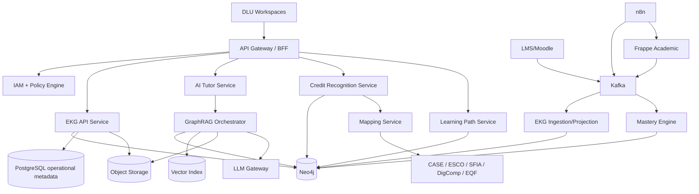

# DLU Educational Knowledge Graph (EKG) 1.1 - Production Architecture

**Status:** Architecture Baseline / Implementation Blueprint  
**Version:** 1.1  
**Audience:** Enterprise Architects, Solution Architects, Data/AI Architects, Backend Developers, Frappe Developers, LMS Integration Team, DevOps/SRE, Security, Academic Product Owners  
**Scope:** Production architecture for integrating the DLU Educational Knowledge Graph into the DLU AI-Native University platform.

---

## 1. Executive Architecture Decision

EKG 1.1 promotes the Educational Knowledge Graph from an ontology/data model into a **production platform capability**. The EKG is the semantic backbone connecting curriculum, outcomes, concepts, skills, assessments, evidence, mastery, career targets and AI agents.

The production target is a hybrid architecture: Frappe remains the transactional academic workflow and approval system; the LMS remains the learning-delivery system; object storage keeps immutable evidence/content artifacts; Neo4j is the semantic graph and read-optimized relationship store; Kafka is the event backbone; n8n handles human-centric integration workflows; a vector index supports semantic retrieval; and the EKG services expose REST and GraphQL contracts to DLU workspaces and agents.

### 1.1 Core principles

1. **Canonical DLU ontology.** External frameworks are mappings, not the internal primary key model.
2. **Source-of-truth explicitness.** Every entity type has one authoritative owner and a defined projection/synchronization policy.
3. **Event-first integration.** No direct cross-system database writes.
4. **Tenant isolation by design.** Tenant scope is propagated from identity through API, events, graph queries, vector retrieval and object storage.
5. **Evidence before inference.** Mastery is derived from provenance-rich evidence, with confidence distinct from mastery.
6. **Graph + vector, not graph versus vector.** GraphRAG uses both structural semantics and semantic similarity.
7. **Human-governed mappings.** ESCO/CASE mappings may be machine suggested but become authoritative only after governed approval.
8. **Explainability.** Learning paths, skill gaps, credit recognition and tutoring return graph paths and evidence provenance.
9. **Append-only learning evidence.** Corrections supersede observations; they do not silently rewrite history.
10. **API and event contracts are versioned products.** Backward compatibility is managed explicitly.

## 2. Logical Architecture



## 3. Production Deployment

### 3.1 Recommended deployment topology

Deploy the stateless EKG services on Kubernetes. Production starts with a minimum of three replicas for public-facing stateless services. Neo4j Enterprise is deployed as a fault-tolerant cluster or consumed as an enterprise managed offering that satisfies DLU RPO/RTO, encryption and residency requirements. Kafka must be a production-grade replicated cluster. PostgreSQL is used only for service operational data, idempotency, outbox state and workflow metadata; it is not a second semantic graph.

**Zones:** edge/API, application services, data services, integration/eventing, AI services, observability/security. Network policies allow only explicitly documented flows.

### 3.2 Environments

- `dev`: synthetic data, single-tenant by default, relaxed capacity.
- `test`: contract/integration tests, representative multi-tenant fixtures.
- `preprod`: production-like topology, masked/synthetic learner data, performance testing.
- `prod`: controlled changes, immutable artifacts, full audit, backups and DR.

No production graph snapshot is copied to lower environments without approved anonymization.

### 3.3 Availability targets

Proposed initial SLOs: API availability 99.9%; read p95 < 500 ms for normal projections; mastery-update event-to-state p95 < 15 s; tutor retrieval p95 < 2.5 s excluding model generation; RPO <= 15 min and RTO <= 2 h for the graph service. These are product targets to validate with capacity tests, not vendor guarantees.

## 4. Microservice Decomposition

| Service | Responsibility | Own data | Sync interfaces |
|---|---|---|---|
| EKG API | canonical graph read/write facade, safe named queries | API metadata/idempotency | REST, GraphQL, Kafka |
| Graph Projection | consumes source events and updates Neo4j | checkpoint/outbox | Kafka -> Neo4j |
| Ontology Registry | schema versions, node/edge types, validation | registry metadata | REST, CI/CD |
| Mapping Service | external framework sync, candidate matching, approval state | mappings | ESCO/CASE adapters, Kafka |
| Mastery Engine | evidence normalization, Bayesian mastery, propagation | model configs | Kafka, Neo4j |
| Learning Path Service | gap/prerequisite constrained path optimization | path snapshots | REST/GraphQL, Neo4j |
| Credit Recognition | source evidence normalization, equivalence scoring, policy application | case state | REST, Frappe, Kafka |
| GraphRAG Orchestrator | graph seed, vector retrieval, rerank, context assembly | retrieval traces | Neo4j, vector, LLM |
| Tutor Service | tutoring policy, personalization and response contract | session metadata | GraphRAG, REST |
| Evidence Service | evidence registration, hashing, provenance | object refs | object store, Kafka |
| Career/Skill Gap | job skill requirements and learner gap | computed projections | Neo4j |
| Audit Service | immutable application audit trail | audit log | Kafka/SIEM |

A separate service is justified when it owns a different consistency boundary, scaling profile, security policy or lifecycle. Avoid a microservice per ontology node.

## 5. Source of Truth and Data Ownership

| Domain | Authoritative system | EKG representation |
|---|---|---|
| Programs, courses, academic approval | Frappe | projected canonical nodes |
| Modules/lessons/content delivery | LMS / content repository | projected nodes and resource links |
| CLO/MLO ontology | Frappe + governed EKG registry | canonical EKG outcome nodes |
| Concepts / prerequisite graph | EKG Ontology Registry | authoritative graph |
| External standards | external source + Mapping Service | versioned mapping nodes |
| Assessment definitions | LMS/Frappe depending workflow | projected nodes |
| Evidence artifacts | immutable object store | evidence metadata/hash nodes |
| Mastery | Mastery Engine | temporal observation/state nodes |
| Job roles | EKG career catalog / ESCO projection | canonical + mapped nodes |
| Workflow approvals | Frappe | status projection/events |

## 6. Frappe Integration and DocTypes

Frappe is the operational workflow layer, not a duplicate graph. The supplied `frappe-doctypes.json` defines production baseline DocTypes for Program, Course, Outcome, Concept, External Mapping, Mastery Observation, Credit Recognition Case and Learning Path.

### 6.1 Frappe synchronization rule

Every authoritative Frappe mutation writes the business record and an **outbox record in the same database transaction**. A publisher emits the corresponding Kafka event. The Graph Projection service consumes it idempotently and updates Neo4j. Synchronous calls to Neo4j inside Frappe save hooks are prohibited for authoritative changes.

### 6.2 Naming and identity

Business identifiers are immutable and tenant-scoped. Human-readable codes may change. Every record has `tenant_id`, canonical `id`, `version`, lifecycle status and provenance. Cross-system references use canonical IDs, not titles.

## 7. Kafka Event Architecture

### 7.1 Topic families

Recommended topics:

- `dlu.academic.program.v1`
- `dlu.academic.course.v1`
- `dlu.academic.outcome.v1`
- `dlu.learning.activity.v1`
- `dlu.assessment.evidence.v1`
- `dlu.mastery.updated.v1`
- `dlu.learningpath.v1`
- `dlu.credit.recognition.v1`
- `dlu.mapping.external.v1`
- `dlu.audit.v1`

Partition key is normally `tenantId + aggregateId`. Events use a CloudEvents-style envelope with event ID, tenant, timestamp, correlation/causation IDs and schema version.

### 7.2 Delivery semantics

Producers enable idempotence. Database + event publication uses transactional outbox/CDC rather than distributed two-phase commit. Consumers maintain an inbox/idempotency table keyed by event ID. Poison messages go to versioned DLQs with diagnostic context. Replaying a topic must be safe.

### 7.3 n8n usage

n8n is appropriate for scheduled standards synchronization, approval routing, notifications, back-office integration and human review. It is deliberately excluded from high-frequency mastery computation, tenant authorization and core event projection.

## 8. REST API

The complete baseline contract is in `openapi.yaml`. APIs are exposed behind an API gateway. Every request resolves:

`identity -> tenant -> roles/scopes -> resource attributes -> policy decision -> repository scope`.

No API accepts a caller-supplied tenant ID as authoritative unless a system-to-system scope explicitly permits cross-tenant administration.

Key resource groups: curriculum, outcomes, concepts, mastery, learning paths, skill gaps, evidence, credit recognition, tutor and external mappings. Expensive computations return asynchronous jobs where appropriate.

## 9. GraphQL API

GraphQL is intended for workspace composition and read-heavy graph projections; REST remains preferred for command semantics and external integrations. The baseline schema is in `schema.graphql`.

Production requirements: persisted queries for browser clients, depth/complexity limits, field-level authorization, DataLoader/batching, query timeout and introspection disabled or restricted in production. GraphQL resolvers never concatenate arbitrary Cypher from the client.

## 10. Neo4j Production Model and Tenancy

### 10.1 Recommended default: shared database, logical isolation

For normal DLU tenants use one production EKG database with `tenantId` mandatory on every tenant-owned node and relationship projection. Repository methods always receive resolved `TenantContext`; Cypher is generated from named query templates. Raw Cypher is not exposed to clients.

Advantages: operational simplicity, efficient cross-tenant software evolution, and ability to maintain shared global taxonomy references. Risks: a missing tenant predicate can cause data leakage, therefore policy enforcement and test automation are mandatory.

### 10.2 High-isolation option: database per tenant

For regulatory, residency or contractual tenants, use Neo4j Enterprise multiple databases. Maintain global/public frameworks in a separate controlled database and expose them through service-level federation or composite graph where operationally appropriate. Transactions should not assume atomic writes across different databases.

### 10.3 Tenant enforcement controls

1. Tenant derived from signed IAM claims.
2. `tenantId` required by schema/ingestion validation.
3. Repository abstraction inserts tenant predicate.
4. Static test scans named Cypher for tenant scoping.
5. Integration tests use two tenants and adversarial IDs.
6. GraphRAG vector metadata repeats tenant/course/ACL scope.
7. Evidence object paths are tenant partitioned and signed.
8. Audit event records policy decision and effective tenant.

### 10.4 Shared nodes

Global taxonomy nodes use `scope='GLOBAL'` and no learner-specific data. Tenant-specific customizations never mutate a global node; create a tenant node with a mapping or extension relation.

## 11. ACL / Authorization Model

Use centralized identity with OAuth2/OIDC and policy-based authorization. RBAC is the coarse layer; ABAC adds tenant, program/course membership, instructor assignment, purpose of use, resource sensitivity and workflow state.

Baseline roles: Student, Instructor, CourseDesigner, ProgramDirector, AcademicQA, CreditOfficer, CareerAdvisor, MappingSteward, EKGAdmin, ServiceAccount, Auditor.

### 11.1 Example policy

A Student may read curriculum published to their tenant and their own mastery/evidence-derived projections. An Instructor may read mastery for learners enrolled in courses they teach but may not access unrelated career or credit-recognition cases. A MappingSteward may approve taxonomy mappings but cannot alter learner evidence. EKGAdmin administers schema and platform, but privileged access to learner data is separately controlled and audited.

### 11.2 AI access

Agents receive a short-lived delegated capability, never a superuser token. Retrieval scope is reduced before vector or graph search. The LLM sees only policy-approved context.

## 12. GraphRAG Architecture

GraphRAG pipeline:

1. authenticate and authorize;
2. classify intent and resolve scope;
3. entity-link question to Course/MLO/Concept/Skill nodes;
4. expand a bounded relationship subgraph;
5. retrieve semantic chunks from vector index with mandatory tenant/ACL metadata filters;
6. optionally run full-text graph search;
7. rerank graph facts + chunks;
8. fetch canonical source passages from content/object store;
9. construct context pack with provenance;
10. generate via LLM gateway;
11. run citation/grounding/policy checks;
12. return answer, sources, graph facts and confidence; store trace with privacy controls.

### 12.1 Retrieval policy examples

`COURSE_GROUNDED`: only published resources attached to enrolled course + global approved concepts.  
`PREREQUISITE_DIAGNOSTIC`: additionally traverses prerequisite concepts and learner mastery.  
`CAREER_COACH`: includes approved skill/job mappings but excludes assessment answers.  
`FACULTY_DESIGN`: includes draft outcomes/rubrics for authorized designers.

### 12.2 Vector design

Store embeddings for learning-resource chunks, outcome statements, concept definitions and approved external labels. Do not embed confidential raw evidence unless a documented use case and retention policy require it. Every vector record contains `tenantId`, `resourceId`, `version`, `aclTags`, `courseIds`, provenance and hash.

## 13. External Mapping Pipeline: CASE and ESCO

### 13.1 CASE

CASE is used as an interoperability boundary for competency frameworks and associations. Import steps: source registration -> version/checksum -> validation -> staging -> GUID preservation -> structural association mapping -> conflict report -> steward approval -> publish mapping events. DLU does not replace internal IDs with CASE GUIDs; it stores them as external identifiers/mappings.

### 13.2 ESCO

ESCO concepts are referenced by URI and pinned ESCO version. Pipeline: fetch/version catalog -> local cache/staging -> lexical + embedding candidate generation -> graph/context reranking -> confidence band -> steward approval -> publish. External mappings are immutable records with lifecycle statuses `Suggested`, `Approved`, `Rejected`, `Deprecated`.

Suggested thresholds for initial calibration: >=0.92 may be presented as high-confidence but still requires approval for canonical use; 0.78-0.92 normal review; below 0.78 not surfaced except expert search. Thresholds must be calibrated on a labeled DLU mapping set.

### 13.3 Mapping provenance

Every mapping stores local entity version, external URI/version, relation (`exactMatch`, `closeMatch`, `broadMatch`, `narrowMatch`, `relatedMatch`), machine score, algorithm version, human reviewer, decision timestamp and notes.

## 14. Mastery Engine

EKG 1.1 uses a confidence-aware Bayesian evidence model. For learner `u` and target `k`, maintain Beta posterior parameters. Expected mastery is `alpha/(alpha+beta)`. Evidence contributes weighted pseudo-counts according to quality, evaluator reliability, temporal decay and authenticity.

This design separates mastery from confidence: a learner can have a high estimated mastery with low confidence if little evidence exists. Missing data falls back to the prior rather than being interpreted as failure.

### 14.1 Evidence weight

`w_e = quality * reliability * recency * authenticity`

With normalized score `s`, update:

`alpha' = alpha + w_e*s`  
`beta'  = beta + w_e*(1-s)`

Temporal decay is applied at query/recompute time to immutable observations. Hierarchical propagation from concept to MLO/CLO/skill uses configured evidence weights; hard prerequisites can cap readiness.

### 14.2 Confidence-sensitive skill gap

Effective mastery:

`E = M * (gamma + (1-gamma)*C)`

Gap:

`G = max(0, required - E)`

Priority additionally multiplies role importance, graph centrality/prerequisite importance and urgency. Full mathematical specification is included in `mastery-engine.md`.

### 14.3 Model governance

Every state records `modelVersion`; recalculation is reproducible. The model is calibrated by cohort and assessment quality, monitored for drift and subgroup anomalies, and never uses protected/sensitive attributes as mastery predictors. LLM judgments are stored as a distinct evidence source and cannot silently override authoritative grades.

## 15. Learning Path Engine

The engine searches for a constrained path from current learner state to target outcomes/skills. Candidate learning items are scored by gap closure, prerequisite satisfaction, expected learning gain, time cost, repetition penalty, learner constraints and evidence confidence.

Objective example:

`utility(item) = gapCoverage * expectedGain * confidenceNeed * relevance - timePenalty - redundancyPenalty`

The engine returns not just the ordered path but an explanation: target gap, prerequisite chain, selected resource/outcome, excluded alternatives and algorithm version.

## 16. Credit Recognition Architecture

Credit recognition is an evidence-and-policy workflow, not pure semantic similarity. It normalizes source transcripts/syllabi/outcomes, maps source outcomes to target CLO/MLO/concepts, measures coverage and level, evaluates assessment/evidence quality, applies institutional policy, then produces a recommendation for automated or human decision depending on confidence and policy.

Recommended score components: outcome semantic alignment, concept coverage, assessment equivalence, level/EQF alignment, workload/ECTS, recency and evidence trust. The final decision and rationale are persisted in Frappe and linked to graph provenance.

## 17. End-to-End Student Workspace

Workspace read model combines enrollment, progress, mastery, weak prerequisites, current learning path, badges/evidence and career goals. It is built via GraphQL/BFF from cached graph projections. The workspace must never compute mastery in the browser.

Events from completed activities trigger mastery recomputation; a `mastery.updated` event invalidates/rebuilds the student read projection. Learning-path recalculation can be automatic on major state changes or user-requested.

## 18. End-to-End Assessment

Assessment submission produces an immutable evidence artifact and a provenance-rich evidence record. Rubric evaluation may be human, deterministic automatic, or AI-assisted; evaluator type is explicit. Evidence events drive mastery updates. A correction creates a superseding evidence/evaluation record rather than editing history without trace.

## 19. End-to-End AI Tutor

Tutor behavior is constrained by the graph. Before answering, it can inspect the student's authorized mastery and prerequisite graph. If the requested concept depends on weak prerequisites, the answer may include a micro-remediation step. The tutor does not expose hidden assessment answers or unauthorized resources. Every grounded response carries resource citations/IDs and graph facts suitable for audit.

## 20. Observability and SRE

Collect OpenTelemetry traces across API -> service -> Neo4j/vector/LLM, using correlation IDs propagated from events and HTTP. Metrics include API p50/p95/p99, graph query latency, Kafka lag, projection failures, mapping review backlog, mastery recompute latency, GraphRAG retrieval hit/grounding rates, token/cost metrics, tenant-level error budget and DLQ depth.

Sensitive payloads are excluded from general logs. Audit logs and operational logs have separate retention/access policies.

## 21. Security and Privacy

- TLS everywhere; mTLS or workload identity service-to-service.
- Secrets in managed secret store, never Frappe config files committed to source.
- Encryption at rest for graph, PostgreSQL, object and vector stores.
- Tenant-aware row/graph/object/vector isolation.
- Data minimization for AI context.
- Signed evidence URLs with short TTL.
- Full provenance/audit for mapping, credit decisions and mastery overrides.
- Deletion/retention workflows distinguish operational account deletion from records that institution policy/legal obligations require to retain.
- Prompt-injection defenses treat retrieved content as data, not executable instructions.

## 22. CI/CD and Schema Governance

Repository structure:

```text
/ontology
  schema/
  migrations/
/contracts
  openapi.yaml
  schema.graphql
  asyncapi.yaml
  events/
/services
  ekg-api/
  mastery/
  mapping/
  graphrag/
  credit-recognition/
/deploy
  helm/
  policies/
/tests
  contract/
  tenant-isolation/
  graph-invariants/
```

Each ontology change requires semantic versioning classification, migration script, backward-compatibility review, SHACL/graph invariant tests, contract tests and sample fixture update. Breaking schema changes require a new API/event major version or compatibility adapter.

## 23. Testing Strategy

Mandatory suites: ontology unit tests, Cypher invariant tests, two-tenant isolation tests, OpenAPI/GraphQL contract tests, Kafka replay/idempotency tests, mastery golden datasets, mapping labeled evaluation set, GraphRAG retrieval/grounding benchmark, credit recognition policy fixtures, load tests, backup restore drills and chaos/failover tests.

Key graph invariants include: every MLO contributes to at least one CLO or is explicitly marked standalone; every published outcome is assessed or waived with reason; no prerequisite cycle unless relation subtype explicitly permits it; approved external mapping points to a pinned framework version; evidence has provenance and immutable artifact hash.

## 24. Migration from EKG 1.0 to 1.1

1. Add `tenantId`, provenance, lifecycle and version attributes to all canonical entities.
2. Split observed evidence from computed mastery state.
3. Introduce Mapping entity instead of direct uncontrolled `sameAs` relationships.
4. Establish Frappe/LMS source ownership and outbox events.
5. Deploy graph projection service and rebuild graph from authoritative events/snapshots.
6. Introduce policy-aware API facade; remove direct application Cypher.
7. Build vector index from approved resources only.
8. Deploy mastery engine in shadow mode; compare with current rules.
9. Enable Student Workspace read projection.
10. Pilot GraphRAG Tutor in one course, then Credit Recognition.

## 25. Implementation Roadmap

**Wave 0 - Foundations (2-4 sprints):** contracts, IDs, tenant context, ontology registry, Neo4j bootstrap, event envelope, outbox, CI tests.  
**Wave 1 - Academic Graph (3-5 sprints):** Frappe/LMS projection, outcomes, concepts, assessments, accreditation queries.  
**Wave 2 - Learner State (3-5 sprints):** evidence service, mastery engine, Student Workspace, learning path MVP.  
**Wave 3 - GraphRAG Tutor (3-5 sprints):** vector ingestion, policy-aware retrieval, grounded tutor, eval harness.  
**Wave 4 - Career + Credit (3-6 sprints):** ESCO mapping, skill gap, career targets, credit recognition workflow.  
**Wave 5 - Hardening:** performance, DR, security assessment, governance, observability, cost optimization.

## 26. Definition of Done for Production Readiness

Production release requires: validated restore procedure; tenant-isolation penetration tests; 100% event contracts in registry; zero direct Neo4j access from UI; idempotent replay demonstrated; mastery reproducibility test passed; mapping provenance complete; GraphRAG grounding benchmark above agreed threshold; security/privacy sign-off; SLO dashboards and alerts active; runbooks assigned to owners.

## 27. Package Contents

- `openapi.yaml`: REST contract baseline.
- `schema.graphql`: GraphQL read/composition + controlled mutations.
- `asyncapi.yaml`: Kafka event catalog.
- `event-envelope.schema.json`: common event envelope.
- `neo4j-bootstrap.cypher`: constraints/index baseline.
- `reference-queries.cypher`: production query examples.
- `frappe-doctypes.json`: Frappe DocType blueprint.
- `n8n-workflows.json`: integration workflow definitions.
- `k8s-reference.yaml`: Kubernetes deployment skeleton.
- `mastery-engine.md`: mathematical model.
- `sequence-diagrams.md`: end-to-end Mermaid sequences.
- `ADR.md`: architectural decisions.

## 28. Standards and Vendor Notes

1EdTech CASE 1.1 is treated as an interoperability standard for competencies/outcomes and associations, not as DLU's internal schema. ESCO is consumed through versioned concepts/URIs. Neo4j Enterprise multi-database capability makes database-per-tenant technically possible when stronger isolation is required, while shared logical tenancy remains the default for operational efficiency. Kafka idempotent/transactional producer features support reliable event publishing, but DLU still uses the transactional outbox pattern for consistency between service databases and the event log.

## 29. Final Architecture Position

EKG 1.1 should be treated as a **platform subsystem**, not a database feature. The graph becomes the machine-understandable contract connecting academic design, learning evidence, student state and AI reasoning. Neo4j is a core component, but the product is the combination of ontology governance, source ownership, event contracts, mastery mathematics, authorization, GraphRAG and explainable services.
