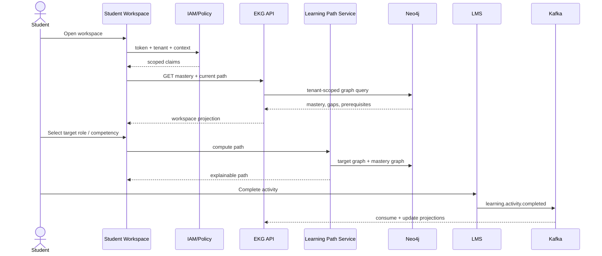
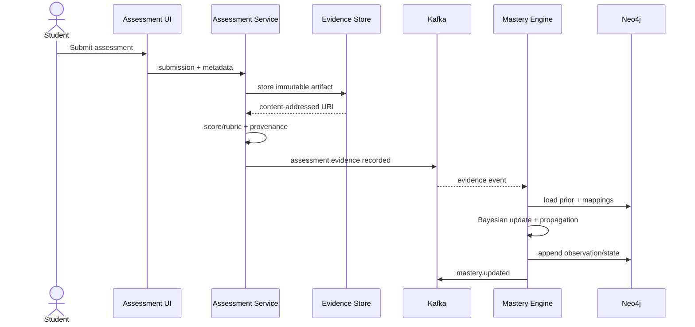
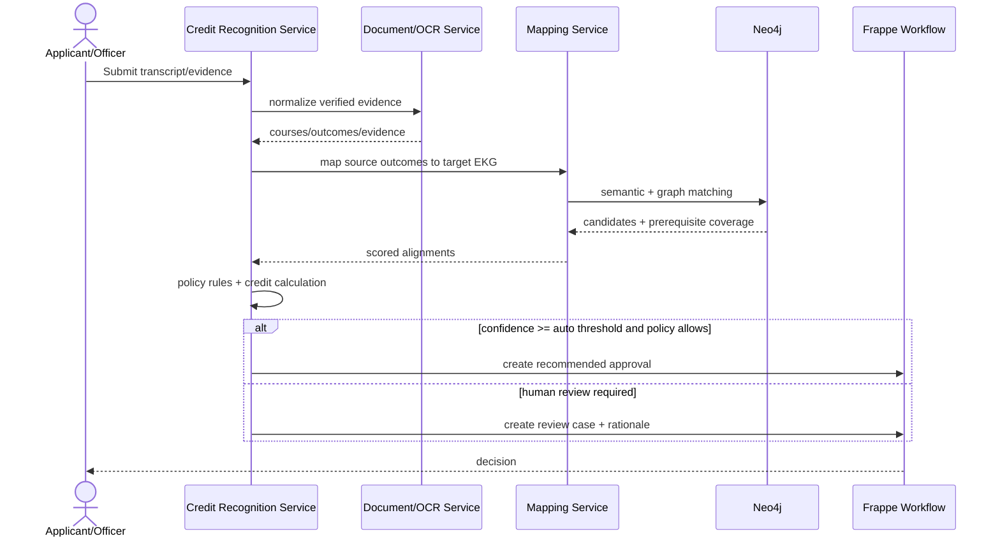
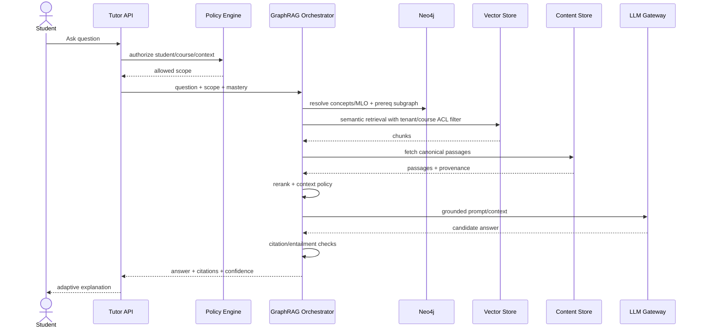

# End-to-End Sequence Diagrams

## Student Workspace

```mermaid
sequenceDiagram
  actor S as Student
  participant WS as Student Workspace
  participant IAM as IAM/Policy
  participant API as EKG API
  participant LP as Learning Path Service
  participant G as Neo4j
  participant LMS as LMS
  participant K as Kafka
  S->>WS: Open workspace
  WS->>IAM: token + tenant + context
  IAM-->>WS: scoped claims
  WS->>API: GET mastery + current path
  API->>G: tenant-scoped graph query
  G-->>API: mastery, gaps, prerequisites
  API-->>WS: workspace projection
  S->>WS: Select target role / competency
  WS->>LP: compute path
  LP->>G: target graph + mastery graph
  LP-->>WS: explainable path
  S->>LMS: Complete activity
  LMS->>K: learning.activity.completed
  K-->>API: consume + update projections
```

## Assessment

```mermaid
sequenceDiagram
  actor S as Student
  participant LMS as Assessment UI
  participant AS as Assessment Service
  participant OBJ as Evidence Store
  participant K as Kafka
  participant ME as Mastery Engine
  participant G as Neo4j
  S->>LMS: Submit assessment
  LMS->>AS: submission + metadata
  AS->>OBJ: store immutable artifact
  OBJ-->>AS: content-addressed URI
  AS->>AS: score/rubric + provenance
  AS->>K: assessment.evidence.recorded
  K-->>ME: evidence event
  ME->>G: load prior + mappings
  ME->>ME: Bayesian update + propagation
  ME->>G: append observation/state
  ME->>K: mastery.updated
```

## Credit Recognition

```mermaid
sequenceDiagram
  actor A as Applicant/Officer
  participant CR as Credit Recognition Service
  participant DOC as Document/OCR Service
  participant MAP as Mapping Service
  participant G as Neo4j
  participant F as Frappe Workflow
  A->>CR: Submit transcript/evidence
  CR->>DOC: normalize verified evidence
  DOC-->>CR: courses/outcomes/evidence
  CR->>MAP: map source outcomes to target EKG
  MAP->>G: semantic + graph matching
  G-->>MAP: candidates + prerequisite coverage
  MAP-->>CR: scored alignments
  CR->>CR: policy rules + credit calculation
  alt confidence >= auto threshold and policy allows
    CR->>F: create recommended approval
  else human review required
    CR->>F: create review case + rationale
  end
  F-->>A: decision
```

## AI Tutor / GraphRAG

```mermaid
sequenceDiagram
  actor S as Student
  participant T as Tutor API
  participant P as Policy Engine
  participant R as GraphRAG Orchestrator
  participant G as Neo4j
  participant V as Vector Store
  participant C as Content Store
  participant L as LLM Gateway
  S->>T: Ask question
  T->>P: authorize student/course/context
  P-->>T: allowed scope
  T->>R: question + scope + mastery
  R->>G: resolve concepts/MLO + prereq subgraph
  R->>V: semantic retrieval with tenant/course ACL filter
  V-->>R: chunks
  R->>C: fetch canonical passages
  C-->>R: passages + provenance
  R->>R: rerank + context policy
  R->>L: grounded prompt/context
  L-->>R: candidate answer
  R->>R: citation/entailment checks
  R-->>T: answer + citations + confidence
  T-->>S: adaptive explanation
```
