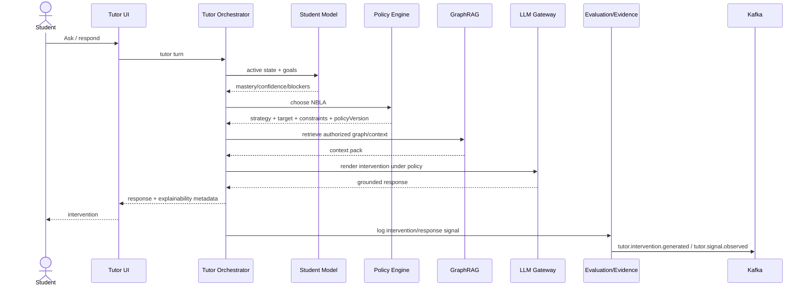
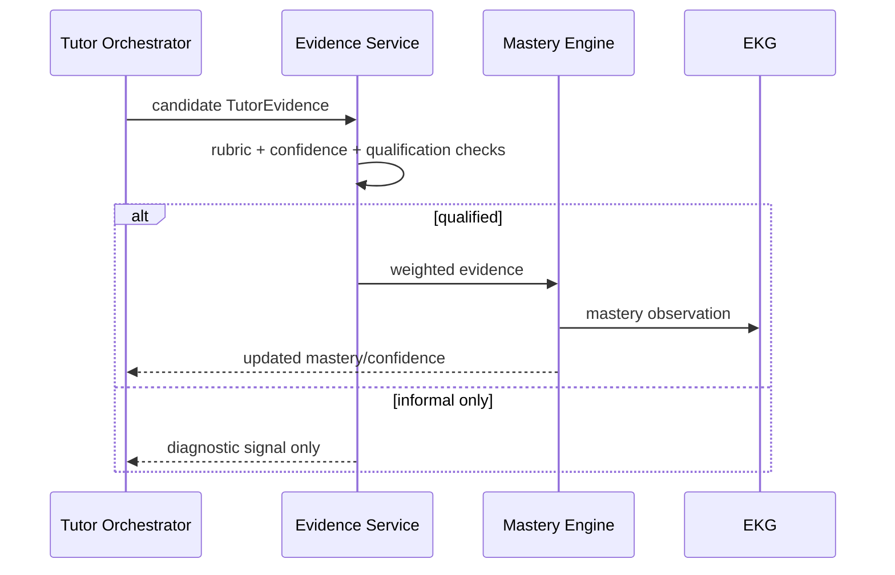

# Tutor Sequence Diagrams — ATA 1.0

## Adaptive tutoring turn

```mermaid
sequenceDiagram
  actor S as Student
  participant UI as Tutor UI
  participant O as Tutor Orchestrator
  participant SM as Student Model
  participant P as Policy Engine
  participant G as GraphRAG
  participant L as LLM Gateway
  participant E as Evaluation/Evidence
  participant K as Kafka
  S->>UI: Ask / respond
  UI->>O: tutor turn
  O->>SM: active state + goals
  SM-->>O: mastery/confidence/blockers
  O->>P: choose NBLA
  P-->>O: strategy + target + constraints + policyVersion
  O->>G: retrieve authorized graph/context
  G-->>O: context pack
  O->>L: render intervention under policy
  L-->>O: grounded response
  O-->>UI: response + explainability metadata
  UI-->>S: intervention
  O->>E: log intervention/response signal
  E->>K: tutor.intervention.generated / tutor.signal.observed
```

## Evidence-qualified response

```mermaid
sequenceDiagram
  participant O as Tutor Orchestrator
  participant E as Evidence Service
  participant M as Mastery Engine
  participant K as EKG
  O->>E: candidate TutorEvidence
  E->>E: rubric + confidence + qualification checks
  alt qualified
    E->>M: weighted evidence
    M->>K: mastery observation
    M-->>O: updated mastery/confidence
  else informal only
    E-->>O: diagnostic signal only
  end
```
