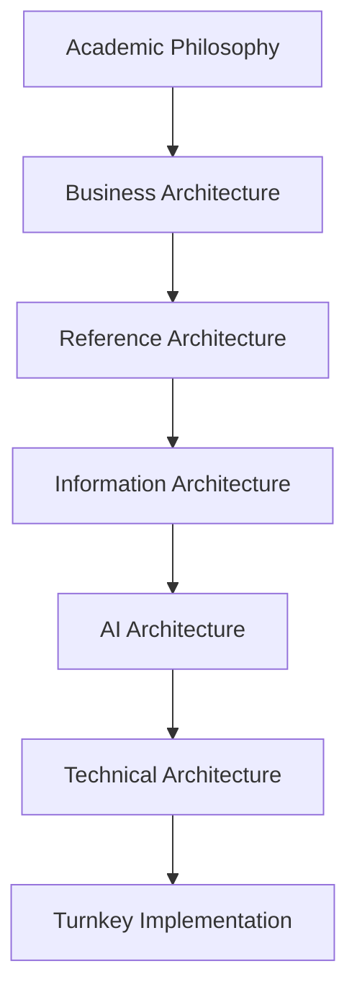

# DLU Architecture Standard

## Purpose

The DLU Architecture Standard defines how to design, implement and govern an AI-Native University.

It treats the university as an **Academic Operating System**, not as an LMS or ERP collection.

## Architecture layers

## Core concepts

- Academic Kernel
- Academic Cognitive Engine (ACE)
- Student, Faculty and Institution Digital Twins
- Academic Knowledge Graph
- Competency Graph
- Academic GPS
- AI Workforce
- Event Mesh
- Evidence-based assessment
- Verifiable credentials
