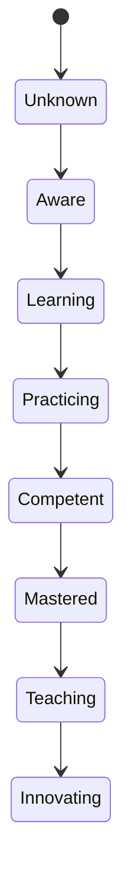

# Continuous Academic Transformation

DLU models learning as a continuous transformation rather than a sequence of course completions.

Transitions must be supported by evidence, assessment and confidence scores.
