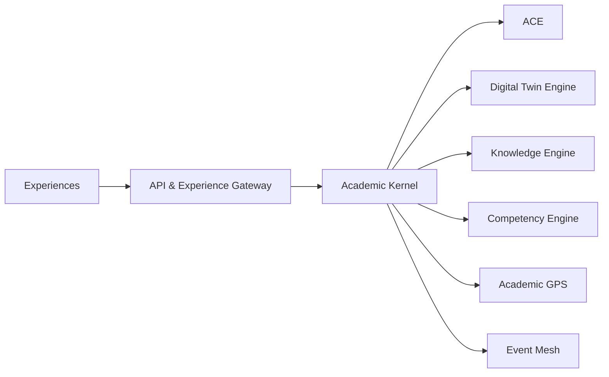

# Academic Kernel

The Academic Kernel is the stable core of the DLU Academic Operating System.

## Engines

- Identity Engine
- Academic Cognitive Engine (ACE)
- Knowledge Engine
- Competency Engine
- Digital Twin Engine
- Learning Engine
- Assessment Engine
- Credential Engine
- Academic GPS Engine
- Workflow Engine
- Event Mesh

