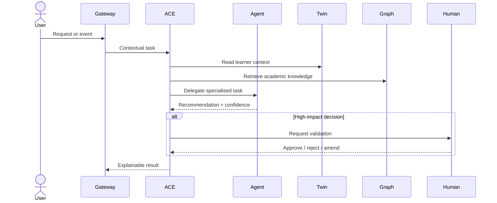

# Academic Cognitive Engine (ACE)

ACE coordinates reasoning, planning, agent selection and governed action.

```mermaid
sequenceDiagram
    actor User
    participant Gateway
    participant ACE
    participant Agent
    participant Twin
    participant Graph
    participant Human

    User->>Gateway: Request or event
    Gateway->>ACE: Contextual task
    ACE->>Twin: Read learner context
    ACE->>Graph: Retrieve academic knowledge
    ACE->>Agent: Delegate specialised task
    Agent-->>ACE: Recommendation + confidence
    alt High-impact decision
        ACE->>Human: Request validation
        Human-->>ACE: Approve / reject / amend
    end
    ACE-->>Gateway: Explainable result
```
